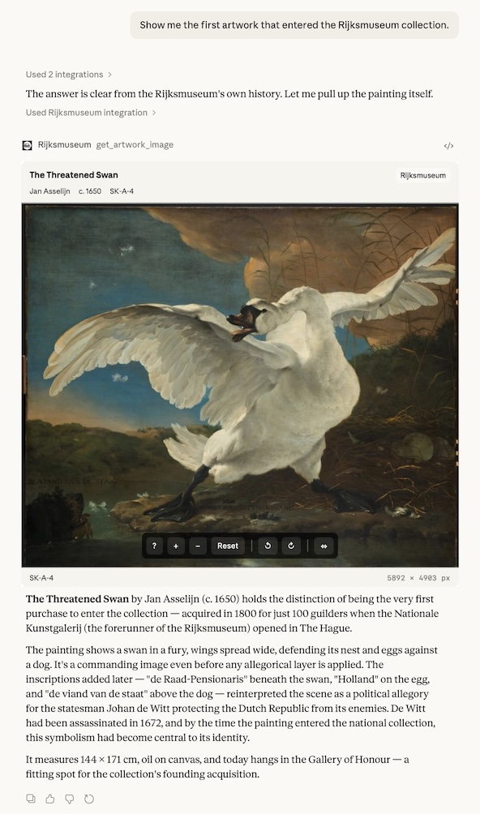

# rijksmuseum-mcp+

### Overview

Note: This README is an **incomplete draft**.

`***Viewing images is temporarily broken*** (27.02.26)`

**rijksmuseum-mcp+** lets you explore the Rijksmuseum's artwork collections through natural conversation with an AI assistant. It does this by creating a [bridge](https://www.anthropic.com/news/model-context-protocol) between the AI system's chat environment and the museum's [open-access, curated metadata](https://data.rijksmuseum.nl). 

You can explore artworks using the same (with minor exceptions) filters provided by the Rijksmuseum on their [search collections](https://www.rijksmuseum.nl/en/collection) page. Beyond this, rijksmuseum-mcp+ offers access to five full-text corpora (`description`, `inscription`, `provenance`, `creditLine`, and `curatorialNarrative`) not directly accessible from the museum's website and [Iconclass](https://iconclass.org), all of which can be searched by keyword or semantically by concept/meaning as well as additional metadata fields including spatial (`nearPlace`) and physical (`minWidth`/`maxHeight`) dimensions. Images from the museum's collections can be viewed directly inside your chat — you can also ask the AI assistant to retrieve images and analyse their content in conjunction with their  metadata. Finally, because much of the data provided by rijksmuseum-mcp+ is already in structured form, it's straightforward for your AI assistant to use these for follow-up tasks, such as visualizations or other analyses.

> This project was inspired by [@r-huijts/rijksmuseum-mcp](https://github.com/r-huijts/rijksmuseum-mcp), the original Rijksmuseum MCP server based on the museum's now superseded REST API. 

**rijksmuseum-mcp+** was developed at the [Research and Infrastructure Support](https://rise.unibas.ch/en/) (RISE) group at the University of Basel and builds on our ongoing work on [benchmarking](https://github.com/RISE-UNIBAS/humanities_data_benchmark) and [optimizing](https://github.com/kintopp/dspy-rise-humbench) humanities research tasks. I am particularly interested in exploring the [technical] and [research] possibilities and challenges posed by interlinking (un)structured data, agentic LLMs, and human users for art historical research. If you are interested in collaborating on these questions, please [get in touch](mailto:rise@unibas.ch).

## Quick Start

The best way to get started is with [Claude Desktop](https://claude.com/download) or [claude.ai](https://claude.ai) by adding a custom 'Connector' to Claude using the URL below. This currently requires a paid ('Pro') [subscription](https://claude.com/pricing) from Anthropic. 
```
https://rijksmuseum-mcp-plus-production.up.railway.app/mcp
```
Goto Settings → Connectors → Add custom connector → Name it whatever you like and paste the URL shown above into the 'Remote MCP Server URL' field. Once the connector has been configured, set the permissions for the individual tools (e.g. 'Always allow'). See Anthropic's [instructions](https://support.claude.com/en/articles/11175166-getting-started-with-custom-connectors-using-remote-mcp#h_3d1a65aded) for more details. 

#### Choosing an AI system

Technically speaking, rijksmuseum-mcp+ is a [Model Context Protocol](https://modelcontextprotocol.io/docs/getting-started/intro) (MCP) server. As such, it is also compatible with many other browser based chatbots including those whose large language models (LLMs) can be used without subscription. Mistral's [LeChat](https://chat.mistral.ai/chat) is a good example. It's also compatible with many open-source desktop 'LLM client' applications such as [Jan.ai](https://jan.ai) that are able to make use of local LLMs, and agentic coding tools such as [Claude Code](https://github.com/anthropics/claude-code) or [OpenAI Codex](https://openai.com/codex/).

In comparison, OpenAI's ChatGPT still only offers limited, 'developer mode' support for MCP servers and while Google has announced MCP support for Gemini it has not indicated when this will be ready. Moreover, the ability the view images inline in the chat is dependent on a [very recent extension](https://blog.modelcontextprotocol.io/posts/2026-01-26-mcp-apps/) of the MCP standard. To date (March, 2026), this feature is only supported by Anthropic in its own products. As an alternative to this, AI assistants can provide links to the Rijksmuseum's own pages for individual artworks.

For all these reasons, [Claude Desktop](https://claude.com/download) or [claude.ai](https://claude.ai) will continue to be the best choice for most users on account of its excellent support of the underlying MCP standard and its tight integration with Anthropic's large language models. For best results, I recommend using rijksmuseum-mcp+ with an Anthropic 'Pro' subscription and the current [Claude Sonnet] model with 'extended thinking' turned on. 

For developers: rijksmuseum-mcp+ can also be run as a local MCP server in STDIO mode with local copies of its metadata and embedding databases. Please see the [technical notes] for details. 

### Sample Questions

After you've added the rijksmuseum-mcp+ 'connector' (aka custom MCP server) to your AI system, test that everything is working correctly by asking your AI assistant to confirm its access: "Which MCP tools can you access to search the Rijksmuseum?". This will give you a list of the different tools provided by the rijksmuseum-mcp+ connector. After that, ask your own questions! 

For example:

"What artworks evoke vanitas and mortality?"  
"Show me artworks depicting places near the Oude Kerk in Amsterdam"  
"What works have the iconclass code for fabulous animals?"  
"Which artworks have a provenance linked to Napoleon?"  
"What are the 'top ten' works in the Rijksmuseum?"  
"I'm looking for artworks with inscriptions mentioning 'luctor et emergo'"  
"Show me sculptures in the collection by artists born in Leiden"  
"Which paintings are wider than 3 meters?"  

### Features

to be added



### How it works

What follows below is an overview of how rijksmuseum-mcp+ (the MCP server) interacts with the metadata sources from the Rijksmuseum and Iconclass, and with the AI assistant in the web browser or desktop application (the MCP client). For a more detailed exposition, please see the [technical note].

When you ask a question in your chat session, the AI assistant first reasons about your query and decides which combination of the MCP server's [tools] is most likely to give you a useful answer drawn from the museum's [metadata]. It then evaluates the initial response and triggers a new round of queries until it is satisfied and presents you with its answer (this is the so-called 'agentic loop'). The MCP tools connect to different parts of the Rijksmuseum's data infrastructure: some queries go directly to the museum's [search API], while others draw on a [vocabulary] database built from a periodic harvest of the museum's collection records. It is also able to direct some queries to an adjacent resource (Iconclass). The results come back to the AI system as structured data, which it then interprets, contextualises, and presents to you in natural language together with an image of the artwork displayed in an interactive image viewer. At each step, the AI model can combine what it retrieves with its own background knowledge — about artists, periods or iconographic traditions, and historical context — to go beyond what the museum's metadata alone would tell you. That said, AI assistants capable of 'tool calling' by interacting with MCP servers have been trained to lean heavily on the information provided by the connected resources.

In this case, because the rijksmuseum-mcp+ MCP server has no direct access to the database driving the museum's [own search portal] it draws its answers from three different sources: a public, less capable, but free to use search interface (API) to its collections, its own database of Rijksmuseum metadata harvested from an alternative (OAI-PMH) public interface, and its own database of the public Iconclass data.

On the one hand, this is more complicated – the AI assistant often needs to route its queries through multiple tools and data sources to answer a question. And a very small subset of queries possible on the museum's website (e.g. `XYZ`) are simply not possible here. On the other hand, because rijksmuseum-mcp+ is partly based on its own copy of Rijksmuseum data, I was able to store, enrich and organise this data however I liked — for example by retrieving the lat/long coordinates of places depicted in artworks (`depictedPlace`), drawing on curated metadata not provided through its search interface (e.g. `description`, `inscription`, `provenance`, `creditLine`, and `curatorialNarrative`) and deciding how to make this most useful researchers (by providing a means to search it semantically and multilingually by meaning/concept). As a result, rijksmuseum-mcp+ trades off simplicity and full control over a relatively small set of search parameters against more powerful and varied exploration and analysis options orchestrated by an AI assistant combined with some arbitrary restrictions on how these can be used. In the end, the users of both systems will need to decide for themselves which set of priorities are more important to them.

to be added: metadata overview table 

### Tips and Limitations

The AI assistant handles search strategy automatically — choosing the right tool, translating between languages, trying alternative phrasings on empty results, and combining filters. The tips below describe how best to leverage these capabilities and how to address the limitations it cannot always compensate for: data coverage gaps, structural limits of the underlying collection metadata, and cases where how you frame your question affects which results you get.

#### Tips

**Say what you are actually looking for, not how to find it.** The assistant generally does better when given a research question than a list of parameters. "What prints were made after paintings by Rembrandt?" works better than "search for prints with technique etching by Rembrandt", because the first framing lets the assistant choose the right combination of tools and strategies.

**For broad queries, add a second constraint.** Searches across very broad categories — all paintings, all works on paper, all portraits — can match tens of thousands of records. The results are not ranked by importance and only a sample is returned (see 'Known Limitations' below). Combining with a date range, production place, or second subject term makes the results both faster and more meaningful.

**Specify "paintings" when that is what you want, especially for concept searches.** Paintings are underrepresented in concept-based (semantic) search results relative to prints and drawings, because those have denser subject tagging in the Rijksmuseum's catalogue. Saying "paintings showing X" rather than just "artworks showing X" helps the assistant apply the right corrections.

**Try a concept search when structured filters return nothing useful.** If searching by subject, Iconclass, or description doesn't find what you're looking for, asking the assistant to try a concept search (semantic search) can find artworks by meaning rather than exact vocabulary terms. This is especially useful for atmospheric or thematic queries like "sense of loneliness" or "cultural exchange." The assistant can also search Iconclass itself by concept — finding the right notation code by meaning rather than exact keyword — and then use that notation for precise structured search. This two-step path avoids the painting underrepresentation that affects direct concept search.

---

#### Known Limitations

**Structured search results are not ranked by relevance.** When filtering by subject, material, place, technique, or other structured fields, results come back in internal catalogue order — not by quality, importance, or closeness to the query. For a large result set, the first page is essentially an arbitrary slice of the matching artworks, not a curated selection. Concept-based (semantic) searches are the exception: those results are ranked by similarity to your query.

**Result sets are capped and only partially paginated.** Each search returns up to 25 results by default (up to 100 on request). For title and creator searches, the assistant can request additional pages beyond the first 100. For searches by subject, material, place, technique, and other structured filters, there is a hard cap of 100 results with no way to continue beyond them. When a query matches thousands of artworks, only a small, non-representative sample is returned. Adding more specific filters is the best way to get meaningful results from large collections.

**Text coverage varies by field.** About 61% of records include a cataloguer's description (in Dutch). Curatorial wall texts (in English) cover only about 14,000 artworks — mostly highlights and recent acquisitions. Searches by description, inscription, provenance, or narrative only cover the portion of the collection where that text exists.

**Geolocation coverage is partial.** About 64% of named production places have been geocoded. Proximity searches ("artworks produced near Delft") will miss artworks from places that haven't been geocoded. Where coordinates exist, they typically point to the nearest town or region rather than a specific workshop address.

**Iconclass subject classification can be counterintuitive.** The Iconclass system assigns subjects to specific branches of a strict hierarchy that does not always match everyday expectations. However, the assistant can search Iconclass by concept as well as by keyword — describing what you're looking for in plain language (e.g. "domestic animals" or "religious suffering") will often find the right notation even when the exact vocabulary term is unknown. Once the right notation is found, it can be used for precise structured search across the full collection.

**The collection data is predominantly in Dutch.** Titles and subject tags are available in Dutch for virtually all records; English is available for roughly a third. The assistant will try both languages automatically, but searches for specialist terminology, historical place names, or older material may miss records that are catalogued only in Dutch.

**Not all artworks have images.** Coverage is good for major works but incomplete for the full collection. The assistant will report when an image is unavailable.

Note: This README is an **incomplete draft**.

### Roadmap

to be added

### Authors

[Arno Bosse](https://orcid.org/0000-0003-3681-1289) — [RISE](https://rise.unibas.ch/), University of Basel with [Claude Code](https://claude.com/product/claude-code), Anthropic.

### Image and Data Credits

<add software license>

Collection data and images are provided by the **[Rijksmuseum, Amsterdam](https://www.rijksmuseum.nl/)** via their [Linked Open Data APIs](https://data.rijksmuseum.nl/).

**Licensing:** Information and data that are no longer (or never were) protected by copyright carry the **Public Domain Mark** and/or **[CC0 1.0](https://creativecommons.org/publicdomain/zero/1.0/)**. Where the Rijksmuseum holds copyright, it generally waives its rights under CC0 1.0; in cases where it does exercise copyright, materials are made available under **[CC BY 4.0](https://creativecommons.org/licenses/by/4.0/)**. Materials under third-party copyright without express permission are not made available as open data. Individual licence designations appear on the [collection website](https://www.rijksmuseum.nl/en/rijksstudio).

**Attribution:** The Rijksmuseum considers it good practice to provide attribution and/or source citation via a credit line and data citation, regardless of the licence applied.

Please see the Rijksmuseum's [information and data policy](https://data.rijksmuseum.nl/policy/information-and-data-policy) for the full terms.

### License

This project is licensed under the [MIT License](LICENSE).
