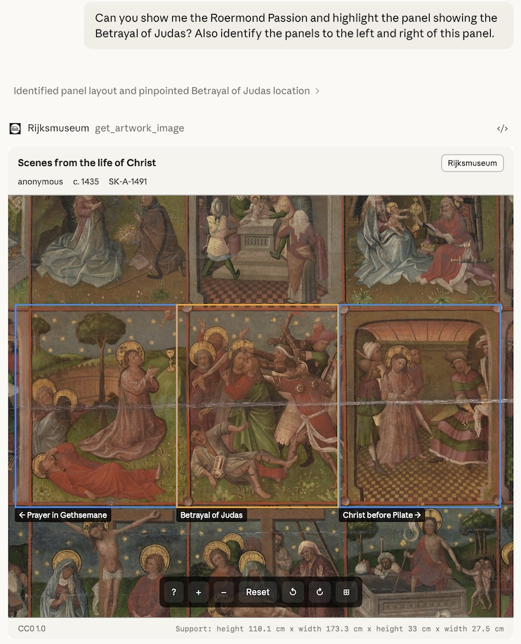

# rijksmuseum-mcp+

### Overview

**rijksmuseum-mcp+** lets you explore the Rijksmuseum's artwork collections through natural conversation with an AI assistant. It does this by creating a [bridge](https://www.anthropic.com/news/model-context-protocol) between the AI system's chat environment and the museum's [open-access, curated metadata](https://data.rijksmuseum.nl). 

> This project was inspired by [@r-huijts/rijksmuseum-mcp](https://github.com/r-huijts/rijksmuseum-mcp), the original Rijksmuseum MCP server based on the museum's now superseded REST API. 

**rijksmuseum-mcp+** was developed at the [Research and Infrastructure Support](https://rise.unibas.ch/en/) (RISE) group at the University of Basel and builds on our ongoing work on [benchmarking](https://github.com/RISE-UNIBAS/humanities_data_benchmark) and [optimizing](https://github.com/kintopp/dspy-rise-humbench) humanities research tasks carried out by large language models (LLMs). We are particularly interested in exploring the [research opportunities](docs/research-scenarios.md) and technical challenges posed by using structured data with LLMs for humanities research. If you are an interested in collaborating on these questions, please [get in touch](mailto:rise@unibas.ch).

### Features

You can explore artworks using rijksmuseum-mcp+ with the same (with minor exceptions) search filters offered by the Rijksmuseum on their [search collections](https://www.rijksmuseum.nl/en/collection) page. Beyond this, it provides the following additional features:

1. **Full-text corpora** — (`description`, `inscription`, `provenance`, `creditLine`, `curatorialNarrative`). This permits, for example, comparative analyses of the collection's catalogue (`description`) and curated wall texts (`curatedNarrative`).

2. **Semantic search** — this enables multilingual, concept/meaning-based explorations across multiple metadata categories. For example, queries like "vanitas symbolism" or "sense of loneliness in domestic interiors" which can't be expressed as structured metadata.

3. **Spatial dimensions** — proximity radius searches on the museum's (`nearPlace`) and size filters (`minWidth`/`maxHeight`) enable spatial queries like "artworks related to places within 25 km of Leiden" or "prints smaller than 10 cm wide" as well as two new parameters (`nearLat` and `nearLon`) to enable spatial queries from arbitrary locations.

4. **More metadata** — several more metadata fields not not accessible from the museum's [search portal](https://www.rijksmuseum.nl/en/collection) (`birthPlace` / `deathPlace`, `profession`, `iconclass`, and `collectionSet`).

5. **Iconclass** — access to its own [Iconclass](https://iconclass.org) database, cross-linked with the Rijksmuseum's metadata, which can be searched and explored not just by notation by also title, description, parent/child classes and semantically by concept.

6. **Interactive Image Viewer** — view high-resolution images of artworks inline in your chat discussion (this feature requires [Claude Desktop](https://claude.com/download) or [claude.ai](https://claude.ai)). Zoom, pan, flip horizontally or view the image full-screen.

7. **Image analysis** (experimental) — the AI assistant can analyse images of artworks using a combination of its own background knowledge and structured data (e.g. "which iconographic elements of the Annunciation in this image have corresponding entries in Iconclass?"). It can also annotate (this feature requires [Claude Desktop](https://claude.com/download) or [claude.ai](https://claude.ai)) these elements in the image itself (e.g. "identify the biblical scenes depicted in the painting's panels and highlight these for me").

8. **Structured outputs** — As most of the data provided by rijksmuseum-mcp+ is in structured form, it's often straightforward for the AI assistant to also represent or export these in a structured manner (e.g. tabular formats) or drawn on them for follow-up tasks, such as visualizations or other analyses.

Please see [this reference](docs/search-parameters.md) for a comprehensive overview of all available search parameters. 

<p align="center"></p>

## Quick Start

The best way to get started is with [Claude Desktop](https://claude.com/download) or [claude.ai](https://claude.ai) by adding a custom 'Connector' to Claude using the URL below. This currently requires a paid ('Pro') [subscription](https://claude.com/pricing) from Anthropic. 
```
https://rijksmuseum-mcp-plus-production.up.railway.app/mcp
```
Goto _Settings_ → _Connectors_ → _Add custom connector_ → Name it whatever you like and paste the URL shown above into the _Remote MCP Server URL_ field. Once the connector is configured, set the permissions for its tools (e.g. 'Always allow'). See Anthropic's [instructions](https://support.claude.com/en/articles/11175166-getting-started-with-custom-connectors-using-remote-mcp#h_3d1a65aded) for more details. 

#### Choosing an AI system

Technically speaking, rijksmuseum-mcp+ is a [Model Context Protocol](https://modelcontextprotocol.io/docs/getting-started/intro) (MCP) server. As such, it also works with many other browser based chatbots including those whose large language models (LLMs) can be used without a paid subscription. Mistral's [LeChat](https://chat.mistral.ai/chat) is a good example. It's also compatible with many open-source desktop 'LLM client' applications such as [Jan.ai](https://jan.ai) that are able to make use of local or cloud based LLMs, and agentic coding tools such as [Claude Code](https://github.com/anthropics/claude-code) or [OpenAI Codex](https://openai.com/codex/).

In comparison, OpenAI's ChatGPT still only offers limited, 'developer mode' support for MCP servers and while Google has announced MCP support for Gemini it has not indicated when this will be ready. Note: the ability the view images inline in the chat is dependent on a [recent extension](https://blog.modelcontextprotocol.io/posts/2026-01-26-mcp-apps/) of the MCP standard. To date (March, 2026) this feature is only supported by Anthropic in its own products. However, even when a MCP client can't support this feature, the AI assistant will still able to provide links to artwork's page at the Rijksmuseum.  Here you can view information about the artwork, zoom into it, and optionally download a high-resolution copy.

**For developers:** rijksmuseum-mcp+ can also be run as a local MCP server in STDIO mode with local copies of its metadata and embedding databases. Please see the [technical notes](docs/technical-guide.md) for details. The [rijksmuseum-se](https://github.com/kintopp/rijksmuseum-se) repo provides Jupyter notebooks and standalone scripts as starting points for interactive explorations of UMAP and PacMAP visualizations of the vocabulary embeddings.

### Sample Questions

After you've added the rijksmuseum-mcp+ 'connector' (aka custom MCP server) to your AI system, test that everything is working correctly by asking your AI assistant to confirm its access: "Which MCP tools can you use to explore the Rijksmuseum's collections?". It should show you a list [like this](docs/available-tools.md).

After that, ask your own questions:

- What artworks evoke vanitas and mortality?
- Show me artworks depicting places near the Oude Kerk in Amsterdam
- What works have the iconclass code for fabulous animals?
- Which artworks have a provenance linked to Napoleon?
- What are the 'top ten' works in the Rijksmuseum?
- I'm looking for artworks with inscriptions mentioning 'luctor et emergo'
- Show me sculptures in the collection by artists born in Leiden
- Which paintings are wider than 3 meters?
- Has anyone taken a tumble in SK-A-1718? Show me where.

For examples of more complex questions, see the [research scenarios](docs/research-scenarios.md). 

### How it works

`to be added`

### Technical notes

`to be added` For now, please see [this file](docs/technical-guide.md).

### Tips and Limitations

The AI assistant handles search strategy automatically — choosing the right tool, translating between languages, trying alternative phrasings on empty results, and combining filters. The tips below describe how best to leverage these capabilities and how to address the limitations it cannot always compensate for: data coverage gaps, structural limits of the underlying collection metadata, and cases where how you frame your question affects which results you get.

#### Tips

**Say what you are actually looking for, not how to find it.** The assistant generally does better when given a research question than a list of parameters. "What prints were made after paintings by Rembrandt?" works better than "search for prints with technique etching by Rembrandt", because the first framing lets the assistant choose the right combination of tools and strategies.

**For broad queries, add a second constraint.** Searches across very broad categories — all paintings, all works on paper, all portraits — can match tens of thousands of records. The results are not ranked by importance and only a sample is returned (see 'Known Limitations' below). Combining with a date range, production place, or second subject term makes the results both faster and more meaningful.

**Specify "paintings" when that is what you want, especially for concept searches.** Paintings are underrepresented in concept-based (semantic) search results relative to prints and drawings, because those have denser subject tagging in the Rijksmuseum's catalogue. Saying "paintings showing X" rather than just "artworks showing X" helps the assistant apply the right corrections.

**Try a concept search when structured filters return nothing useful.** If searching by subject, Iconclass, or description doesn't find what you're looking for, asking the assistant to try a concept search (semantic search) can find artworks by meaning rather than exact vocabulary terms. This is especially useful for atmospheric or thematic queries like "sense of loneliness" or "cultural exchange." The assistant can also search Iconclass itself by concept — finding the right notation code by meaning rather than exact keyword — and then use that notation for precise structured search. This two-step path avoids the painting underrepresentation that affects direct concept search.

**The MCP server (rijksmuseum-mcp+) seems stuck**. If the server is not responding or seems stuck, it could be that it's been updated. To fix this, in your AI system's (aka MCP client's) settings (e.g. in _Settings_ in Claude Desktop or claude.ai) disconnect and reconnect the server, and then click on _Configure_ to verify that all permissions are still set correctly. In other MCP clients, you may not be able to disconnect/reconnect. In that case, remove/add the rijksmuseum-mcp+ MCP server using its remote URL: `https://rijksmuseum-mcp-plus-production.up.railway.app/mcp`.

#### Known Limitations

**Structured search results are not ranked by relevance.** When filtering by subject, material, place, technique, or other structured fields, results currently come back in internal catalogue order — not by quality, importance, or closeness to the query. For a large result set, the first page is essentially an arbitrary slice of the matching artworks, not a curated selection. Concept-based (semantic) searches are the exception: those results are ranked by similarity to your query. 

**Result sets are capped and only partially paginated.** Each search returns up to 25 results by default (up to 100 on request). For title and creator searches, the assistant can request additional pages beyond the first 100. For searches by subject, material, place, technique, and other structured filters, there is currently a hard cap of 100 results. When a query matches thousands of artworks, only a small, non-representative sample is returned. Adding more specific filters is the best way to get meaningful results from large collections and helps prevent the LLM being overwhelmed with metadata from hundreds of search results.

**Text coverage varies by field.** About 61% of records include a cataloguer's description (in Dutch). Curatorial wall texts (in English) cover only about 14,000 artworks — mostly highlights and recent acquisitions. Searches by description, inscription, provenance, or narrative only cover the portion of the collection where that text exists.

**Geolocation coverage is partial.** About 64% of named production places have been geocoded. Proximity searches ("artworks produced near Delft") will miss artworks from places that haven't been geocoded. Where coordinates exist, they typically point to the nearest town or region rather than a specific workshop address.

**Iconclass subject classification can be counterintuitive.** The Iconclass system assigns subjects to specific branches of a strict hierarchy that does not always match everyday expectations. However, the assistant can search Iconclass by concept as well as by keyword — describing what you're looking for in plain language (e.g. "domestic animals" or "religious suffering") will often find the right notation even when the exact vocabulary term is unknown. Once the right notation is found, it can be used for precise structured search across the full collection.

**The collection data is predominantly in Dutch.** Titles and subject tags are available in Dutch for virtually all records; English is available for roughly a third. The assistant will try both languages automatically, but searches for specialist terminology, historical place names, or older material may miss records that are catalogued only in Dutch.

**Image analysis works better than image annotation.** Currently, Anthropic's models are more accurate at describing the contents of an image than annotating it. For example, the models will often accurately describe what can be seen (sometimes drawing on the content rich `description` data for guidance) but struggle to draw bounding-boxes around this content (the bounding boxes are usually approximately in the same area but offset).

### Roadmap

**Soon:**

- add support for `assigned_by attribution` metadata (e.g. "attributed to", "workshop of", and "follower of")
- reduce dependencies on Rijskuseum [Search API](https://data.rijksmuseum.nl/docs/)
- improve documentation
- fine-tuning

**Later:**

- address inconsistent pagination and ranked results issues
- add support for optional [SKILL](https://support.claude.com/en/articles/12580051-teach-claude-your-way-of-working-using-skills) files
- add support for LLM analysis of user defined image selections
- address print vs. painting bias in semantic search from unbalanced subject labels
- review toponyms without clear geolocation data
- investigate support for MCP elicitations
- paper/presentation

**Maybe:**

- investigate integration with other Linked Open Data resources (e.g. [Colonial Collections](https://data.colonialcollections.nl))
- investiagte support for image similarity search (whole image, [image segments](https://engineering.q42.nl/visual-search/)

### Authors

[Arno Bosse](https://orcid.org/0000-0003-3681-1289) — [RISE](https://rise.unibas.ch/), University of Basel with [Claude Code](https://claude.com/product/claude-code), Anthropic.

### Image and Data Credits

Collection data and images are provided by the **[Rijksmuseum, Amsterdam](https://www.rijksmuseum.nl/)** via their [Linked Open Data APIs](https://data.rijksmuseum.nl/).

**Licensing:** Information and data that are no longer (or never were) protected by copyright carry the **Public Domain Mark** and/or **[CC0 1.0](https://creativecommons.org/publicdomain/zero/1.0/)**. Where the Rijksmuseum holds copyright, it generally waives its rights under CC0 1.0; in cases where it does exercise copyright, materials are made available under **[CC BY 4.0](https://creativecommons.org/licenses/by/4.0/)**. Materials under third-party copyright without express permission are not made available as open data. Individual licence designations appear on the [collection website](https://www.rijksmuseum.nl/en/rijksstudio).

**Attribution:** The Rijksmuseum considers it good practice to provide attribution and/or source citation via a credit line and data citation, regardless of the licence applied.

Please see the Rijksmuseum's [information and data policy](https://data.rijksmuseum.nl/policy/information-and-data-policy) for the full terms.

### License

This project is licensed under the [MIT License](LICENSE).
