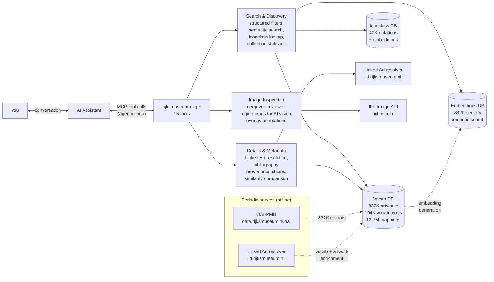
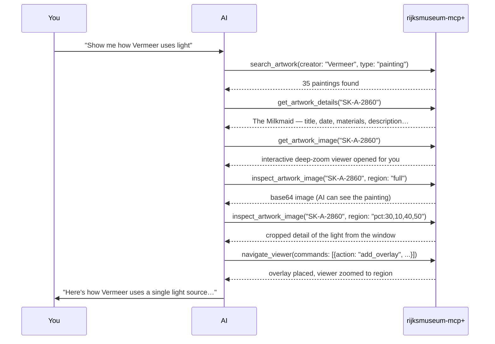

# rijksmuseum-mcp+

[](https://safeskill.dev/scan/kintopp-rijksmuseum-mcp-plus)

[](https://modelcontextprotocol.io/specification/2025-11-25)
[](https://github.com/modelcontextprotocol/ext-apps)

## Overview

**rijksmuseum-mcp+** lets you explore the Rijksmuseum's artwork collections through natural conversation with an AI assistant. It does this by creating a [bridge](https://www.anthropic.com/news/model-context-protocol) between the AI system's chat environment and the museum's [open-access, curated metadata](https://data.rijksmuseum.nl). It then extends this data with semantic search, provenance analysis, visual similarity, and spatial reasoning.

> This project was inspired by [@r-huijts/rijksmuseum-mcp](https://github.com/r-huijts/rijksmuseum-mcp), the original Rijksmuseum MCP server based on the museum's now superseded REST API. 

The tool was developed as a technology demo by the [Research and Infrastructure Support](https://rise.unibas.ch/en/) (RISE) group at the University of Basel and complements our ongoing work on [benchmarking](https://github.com/RISE-UNIBAS/humanities_data_benchmark) and [optimizing](https://github.com/kintopp/dspy-rise-humbench) humanities research tasks carried out by large language models (LLMs). We are particularly interested in exploring the [research opportunities](docs/research-scenarios.md) and technical challenges posed by retrieving and analysing structured data with LLMs. If you are interested in collaborating with us in this area, please [get in touch](mailto:rise@unibas.ch).

## Quick Start

The best way to get started is with [Claude Desktop](https://claude.com/download) or [claude.ai](https://claude.ai) by adding rijksmuseum-mcp+ as a custom 'Connector' to Claude using the URL below. This currently requires a paid ('Pro') or higher [subscription](https://claude.com/pricing) from Anthropic.
```
https://rijksmuseum-mcp-plus-production.up.railway.app/mcp
```
Goto _Settings_ → _Connectors_ → _Add custom connector_ → Name it as you like and paste the URL into the _Remote MCP Server URL_ field. You can ignore the Authentication section. Once the connector is configured, optionally set the permissions for its tools (e.g. 'Always allow'). See Anthropic's [instructions](https://support.claude.com/en/articles/11175166-get-started-with-custom-connectors-using-remote-mcp) for more details.

Technically speaking, rijksmuseum-mcp+ is based on the open [Model Context Protocol](https://modelcontextprotocol.io/docs/getting-started/intro) (MCP) standard. As such, it also works with generative large language models (LLMs) in other chatbots and applications which support the MCP standard, including several which can be used **without a paid subscription**. However, none beside [Claude Desktop](https://claude.com/download) and [claude.ai](https://claude.ai) support viewing and interacting with images and visualisations in the chat timeline. For more details, please see the [Choosing an AI system](#choosing-an-ai-system) section below.

## Sample Queries

After you've connected rijksmuseum-mcp+ to your AI system, you can explore the collection in natural language. The shared links below are to sample responses to these queries in Claude Desktop. They only reproduce the textual portion of the response (no image viewer or visualisations). 

- _What German artworks evoke vanitas and mortality?_ [link](https://claude.ai/share/2d38db0c-82e2-434a-a48b-cfe3cbbcfec5)
- _List portrait photographs by American female photographers in the collection_ [link](https://claude.ai/share/704b1dd1-6591-4fc5-b6a8-80cf38ad1df3)
- _Which artworks have a provenance linked to Emperor Bonaparte?_ [link](https://claude.ai/share/0f38737d-176b-4c46-bb3d-044404e0b334)
- _Show artworks which include an inscription saying, 'Amor vincit omnia'_ [link](https://claude.ai/share/7415012a-5062-4866-a3e8-9278e9532a21)
- _Find artworks similar to SK-A-2350_ [link](https://kintopp.github.io/rijksmuseum-mcp-plus/similar-to-SK-A-2350.html)
- _Which work in the collection had previously been held for the longest time by the same family?_ [link](https://claude.ai/share/157e5fd1-c8bd-497f-9fa2-36b21482f6e5)
- _Show me sculptures in the collection by artists born in Leiden_ [link](https://claude.ai/share/077db4fb-d748-4b17-86fa-494a982b5bcb)
- _What are the three largest paintings in the collection by width?_ [link](https://claude.ai/share/1a7f9a3c-012c-4065-9222-fbfca265585a)
- _Which 15th-century paintings are listed as workshop productions?_ [link](https://claude.ai/share/8733dcfc-4d25-4efd-b2af-6b2c3cddd7bb)
- _What types of works does the collection have from Indonesia?_ [link](https://claude.ai/share/4f1bfe09-7620-4f45-9013-c719420ddf21)
- _Show me the Roermondse passie and highlight the Betrayal of Judas_ [link](https://claude.ai/share/ca56c81b-7422-477e-9839-f921c0423c03)
  (requires [Claude Desktop](https://claude.com/download) or [claude.ai](https://claude.ai))

For samples of more complex queries, please see the [research scenarios](docs/research-scenarios.md).

<p align="center"></p>

## Features

You can use rijksmuseum-mcp+ to explore artworks with the same (with minor exceptions) search filters offered by the Rijksmuseum on their [search collections](https://www.rijksmuseum.nl/en/collection) page. Beyond this, rijksmuseum-mcp+ provides the following additional features:

1. **More searchable metadata**

These are metadata fields not searchable from the museum's [search portal](https://www.rijksmuseum.nl/en/collection). Significantly, several full-text fields (`description`, `inscription`, `provenance`, `creditLine`, `curatorialNarrative`) with search results ranked by relevance. Also searchable now are, for example, `creator` demographics (e.g. `gender`, `profession`, `birthPlace`), `title` variants, attribution qualifiers (e.g. `workshop of`, `circle of`, `attributed to`), bibliography citations for individual artworks, and [Iconclass](https://iconclass.org). The Iconclass notations can be searched by title and description and explored by following their parent and child branches. Proximity searches on geocoded locations (`nearPlace`, `nearPlaceRadius`) let you find artworks related to a location (e.g. "artworks depicting places within 25 km of Leiden"). Physical dimension filters support queries on artwork size (e.g. "paintings wider than 3 metres"). Collection-wide aggregate statistics (counts, distributions, and cross-tabulations across any dimension) are available via `collection_stats`. Full details are documented in [metadata categories](/docs/metadata-categories.md) and [search parameters](/docs/search-parameters.md).

2. **Semantic search** 

Multilingual, concept-based search drawing simultaneously on the full-text of several metadata fields (`title`, `description`, `inscription`, `curatorialNarrative`). This allows for broad, interpretive queries by meaning — such as "a sense of loneliness in domestic interiors" or "vanitas symbolism" — that go beyond what structured metadata filters can express. Iconclass notations can also be searched semantically, letting you find artworks by concept rather than exact notation code. For implementation details, see [semantic search](/docs/semantic-search.md).

3. **Interactive image viewer and AI analysis**

View high-resolution artwork images inline in your chat conversation using a deep-zoom viewer that supports pan, zoom, rotation, horizontal flip, and full-screen mode (click on the ? icon in the image viewer for details). The AI assistant can analyse what it sees in conjunction with the collection's metadata, and can zoom into and annotate regions of interest. You can also (click on the □ icon) draw a rectangle around an area to copy its coordinates into the prompt and direct the assistant's attention to it (e.g. "identify the species of butterfly highlighted in this still life"). Note: this feature requires [Claude Desktop](https://claude.com/download) or [claude.ai](https://claude.ai). Other chatbots and applications can still view artworks and use the deep-zoom feature via the linked Rijksmuseum pages.

4. **Analyse similar artworks** 

A search for artworks `similar to` other artworks creates an interactive comparison page that places an artwork alongside the works most similar to it, evaluated across six independent dimensions: visual appearance, semantic description, Iconclass subject classification, artistic lineage (shared creators, workshops, or attribution chains), depicted persons, and depicted places. Works that appear across multiple dimensions are surfaced in a combined "pooled" view, highlighting the most broadly connected artworks in the collection. Here is [an example](https://kintopp.github.io/rijksmuseum-mcp-plus/similar-to-SK-A-2350.html) of a `find_similar` analysis.

5. **Analyse provenance events** (experimental)

The Rijksmuseum records the ownership history of c. 48,000 artworks as free-text provenance narratives following the [AAM punctuation convention](https://www.museumprovenance.org/pages/standard_v1/). rijksmuseum-mcp+ [parses](/docs/rijksmuseum-mcp+/references/provenance-patterns.md) these narratives into over 100,000 structured events with a [CMOA-aligned transfer vocabulary](https://www.museumprovenance.org/reference/acquisition_methods/), making them searchable by party name, transfer type (sale, gift, bequest, inheritance, confiscation, restitution, and others), date range, location, and price in the original historical currency. This enables queries such as tracing a collector's activity across the collection, identifying artworks that were confiscated but never restituted, or comparing auction prices in guilders across centuries.

6. **Research skill package** (experimental)

The [`rijksmuseum-mcp+` skill package](docs/rijksmuseum-mcp+.skill) gives a large language model (LLM) detailed guidance (written in natural language) on how best to use the rijksmuseum-mcp+ tools effectively: which tool to choose for a given question type, how to combine searches, important metadata distinctions (e.g. `productionPlace` vs `depictedPlace`, `subject` vs `iconclass`), known limitations with tested workarounds, and the full provenance data model. Installing the skill is optional but will significantly improve the quality and efficiency of an LLM's responses when exploring the collection. It can be installed in Claude by following [these instructions](https://support.claude.com/en/articles/12580051-teach-claude-your-way-of-working-using-skills). Skill files were originally developed by Anthropic for their Claude products but have now become an [open standard](https://agentskills.io/home). Even chatbots and applications without explicit support for skill packages can make use of the rijksmuseum-mcp+ skill by uploading/sharing [its components](/docs/rijksmuseum-mcp%2B) (`SKILL.md`, `provenance-patterns.md`) with the LLM directly at the start of a research session.

## Choosing an AI system

Technically speaking, rijksmuseum-mcp+ works with any chatbot or application supporting the open [Model Context Protocol](https://modelcontextprotocol.io/docs/getting-started/intro) (MCP) and [MCP Apps](https://modelcontextprotocol.io/extensions/apps/overview) standards. As such, it also works with many other browser based chatbots including those whose large language models (LLMs) can be used **without a paid subscription**. Mistral's [LeChat](https://chat.mistral.ai/chat) is a good example (follow [these instructions](https://help.mistral.ai/en/articles/393572-configuring-a-custom-connector)) of a browser based chatbot with good, basic support of the MCP standard. In addition, many desktop 'LLM client' applications, such as [Jan.ai](https://jan.ai), are also MCP-compatible, and can be used with many different LLM models. Many agentic coding applications (e.g. Claude Code, OpenAI Codex, Google Gemini CLI) also support the MCP standard. In contrast, OpenAI's ChatGPT still only offers limited, 'developer mode' support for MCP servers, and while Google has announced MCP support for Gemini it has not indicated when this will be ready.  

In practice, however, the extent and quality of support of these standards varies widely. Moreover, none of these alternatives allow you to view and interact with images directly in the chat timeline. For this reason, despite the existence of many partially adequate solutions, at present (April, 2026) the only way to use all the features provided by rijksmuseum-mcp+ is with [Claude Desktop](https://claude.com/download) or [claude.ai](https://claude.ai) and a paid ('Pro') or higher [subscription](https://claude.com/pricing) from Anthropic. 

Note to developers: the rijksmuseum-mcp+ server can also be run locally in STDIO mode with local copies of its metadata and embedding databases. Please see the [technical notes](docs/technical-guide.md) for details.

## How it works

When you submit your question, the AI assistant decides on the basis of their [descriptions](/docs/mcp-server+tool-descriptions.md) which combination of [tools](/docs/available-tools.md) and [search parameters](/docs/mcp-tool-parameters.md) provided by rijksmuseum-mcp+ will best answer it from the museum's [metadata](/docs/metadata-categories.md). It might [search](/docs/search-parameters.md) the collection by structured filters (`search_artwork`), look up an artwork's full metadata (`get_artwork_details`), query ownership history (`search_provenance`), or find works by meaning rather than keyword (`semantic_search`) — often chaining several tools in sequence (the so-called 'agentic loop'), each result informing the next. Most queries go directly to a vocabulary database built from a periodic harvest of the museum's collection records, while concept-based queries are routed to semantic similarity search. The results come back as structured data, which the AI interprets, contextualises, and presents in natural language (where requested alongside an artwork displayed in an interactive deep-zoom image viewer). Crucially, at each step, the AI can combine this retrieved data with its own background knowledge — about artists, periods, iconographic traditions, and historical context — to go beyond what the museum's metadata alone can provide.

rijksmuseum-mcp+ draws primarily on metadata harvested from the Rijksmuseum's [Linked Open Data](https://data.rijksmuseum.nl/docs/data-dumps/) and [OAI-PMH](https://data.rijksmuseum.nl/docs/oai-pmh/) interfaces, the museum's [Linked Art resolver](https://data.rijksmuseum.nl/docs/linked-art/) for individual artwork details, and public [Iconclass](https://iconclass.org) data. The museum's [Search API](https://data.rijksmuseum.nl/docs/search) is used only as a fallback for finding object-numbers when the vocabulary database is unavailable. 

Because rijksmuseum-mcp+ maintains its own copy of Rijksmuseum and Iconclass metadata, it can store, enrich, and organise this in ways that aid research on the collections. For example:

- indexing curated metadata not exposed through the museum's search interface
- generating embeddings for semantic search by meaning and concept
- geocoding toponyms with existing place identifiers for proximity and region-based search
- parsing provenance texts into structured ownership chains with events, parties, prices, and dates
- comparing artworks across multiple modalities of similarity

In essence, rijksmuseum-mcp+ trades the conceptual simplicity of a traditional search interface, where you formulate a query, receive results, and interpret them yourself, for a more flexible and powerful but also more complex scenario, where an AI assistant with direct access to curated metadata can search, combine, and interpret results together with a researcher. 


```mermaid
flowchart LR
    User["You"] <-->|conversation| AI["AI Assistant"]

    AI <-->|"MCP tool calls
    (agentic loop)"| Server["rijksmuseum-mcp+
    15 tools"]

    Server --> Search["Search & Discovery
    structured filters,
    semantic search,
    Iconclass lookup,
    collection statistics"]

    Server --> Details["Details & Metadata
    Linked Art resolution,
    bibliography,
    provenance chains,
    similarity comparison"]

    Server --> Images["Image Inspection
    deep-zoom viewer,
    region crops for AI vision,
    overlay annotations"]

    Search --> VocabDB[("Vocab DB
    832K artworks
    194K vocab terms
    13.7M mappings")]
    Search --> EmbeddingsDB[("Embeddings DB
    832K vectors
    semantic search")]
    Search --> IconclassDB[("Iconclass DB
    40K notations
    + embeddings")]
    Details --> LinkedArt["Linked Art resolver
    id.rijksmuseum.nl"]
    Details --> VocabDB
    Images --> IIIF["IIIF Image API
    iiif.micr.io"]

    subgraph Harvest ["Periodic harvest (offline)"]
        OAI["OAI-PMH
        data.rijksmuseum.nl/oai"]
        LA2["Linked Art resolver
        id.rijksmuseum.nl"]
    end
    OAI -.->|"832K records"| VocabDB
    LA2 -.->|"vocab + artwork
    enrichment"| VocabDB
    VocabDB -.->|"embedding
    generation"| EmbeddingsDB
```

**The agentic loop:** the AI assistant doesn't make one call to the MCP server and stop — it chains tools iteratively, each result informing the next. A single question like *"show me how Vermeer uses light"* might trigger:


```mermaid
sequenceDiagram
    participant You
    participant AI
    participant MCP as rijksmuseum-mcp+

    You->>AI: "Show me how Vermeer uses light"

    AI->>MCP: search_artwork(creator: "Vermeer", type: "painting")
    MCP-->>AI: 35 paintings found

    AI->>MCP: get_artwork_details("SK-A-2860")
    MCP-->>AI: The Milkmaid — title, date, materials, description…

    AI->>MCP: get_artwork_image("SK-A-2860")
    MCP-->>AI: interactive deep-zoom viewer opened for you

    AI->>MCP: inspect_artwork_image("SK-A-2860", region: "full")
    MCP-->>AI: base64 image (AI can see the painting)

    AI->>MCP: inspect_artwork_image("SK-A-2860", region: "pct:30,10,40,50")
    MCP-->>AI: cropped detail of the light from the window

    AI->>MCP: navigate_viewer(commands: [{action: "add_overlay", ...}])
    MCP-->>AI: overlay placed, viewer zoomed to region

    AI->>You: "Here's how Vermeer uses a single light source…"
```
## Technical notes

For local setup (stdio or HTTP), deployment, architecture, data sources, and configuration, see the [technical guide](/docs/technical-guide.md). Further technical documentation TBA.

## Roadmap

Soon:

- update documentation
- fine-tune query strategies
- fix bugs
- v1.0 release
- paper/presentation

Later:

- create a [SKILL](https://support.claude.com/en/articles/12580051-teach-claude-your-way-of-working-using-skills) file for exploring the collection
- review capabilities of MCP clients besides Anthropic's Claude
- add provenance metadata for geolocated places
- investigate adding `attributed_by` technical metadata (e.g. conservation and scientific analyses)

Maybe:

- investigate adding `attributionQualifier`: "Signed by", "Manner of", "Rejected maker", "Falsification after" 
- investigate separate windows for chat and image viewer
- investigate incorporating historical exhibition data
- investigate integration with other Linked Open Data resources (e.g. [Colonial Collections](https://data.colonialcollections.nl))
- investigate browsing related images in the image viewer
- review places without geolocation data

## Authors

[Arno Bosse](https://orcid.org/0000-0003-3681-1289) — [RISE](https://rise.unibas.ch/), University of Basel with [Claude Code](https://claude.com/product/claude-code), Anthropic.

## Citation

If you use rijksmuseum-mcp+ in your research, please cite it as follows. A `CITATION.cff` file is included for use with Zotero, GitHub's "Cite this repository" button, and other reference managers.

**APA (7th ed.)**

> Bosse, A. (2026). *rijksmuseum-mcp+* (Version 0.23) [Software]. Research and Infrastructure Support (RISE), University of Basel. https://github.com/kintopp/rijksmuseum-mcp-plus

**BibTeX**
```bibtex
@software{bosse_2026_rijksmuseum_mcp_plus,
  author    = {Bosse, Arno},
  title     = {{rijksmuseum-mcp+}},
  year      = {2026},
  version   = {0.23},
  publisher = {Research and Infrastructure Support (RISE), University of Basel},
  url       = {https://github.com/kintopp/rijksmuseum-mcp-plus},
  orcid     = {0000-0003-3681-1289},
  note      = {Developed with Claude Code (Anthropic, \url{https://www.anthropic.com})}
}
```

## Image and Data Credits

Collection data and images are provided by the **[Rijksmuseum, Amsterdam](https://www.rijksmuseum.nl/)** via their [Linked Open Data APIs](https://data.rijksmuseum.nl/).

**Licensing:** Information and data that are no longer (or never were) protected by copyright carry the **Public Domain Mark** and/or **[CC0 1.0](https://creativecommons.org/publicdomain/zero/1.0/)**. Where the Rijksmuseum holds copyright, it generally waives its rights under CC0 1.0; in cases where it does exercise copyright, materials are made available under **[CC BY 4.0](https://creativecommons.org/licenses/by/4.0/)**. Materials under third-party copyright without express permission are not made available as open data. Individual licence designations appear on the [collection website](https://www.rijksmuseum.nl/en/rijksstudio).

**Attribution:** The Rijksmuseum considers it good practice to provide attribution and/or source citation via a credit line and data citation, regardless of the licence applied.

Please see the Rijksmuseum's [information and data policy](https://data.rijksmuseum.nl/policy/information-and-data-policy) for the full terms.

## License

This project is licensed under the [MIT License](LICENSE).
