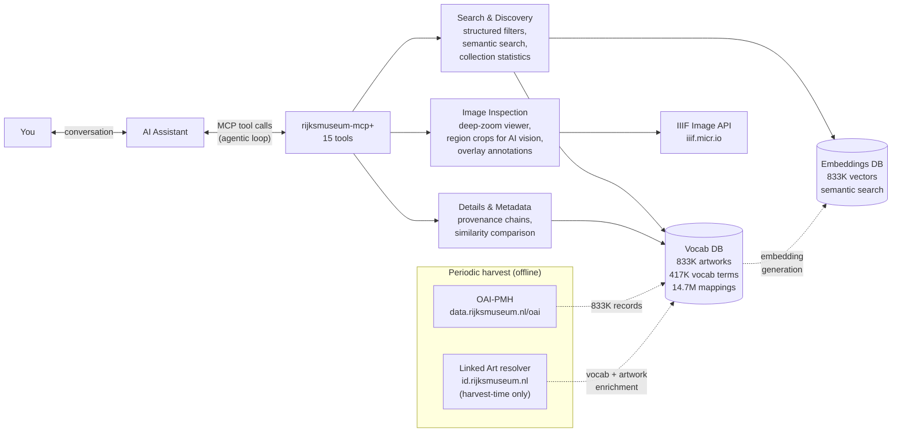

# rijksmuseum-mcp+

[](https://modelcontextprotocol.io/specification/2025-11-25)
[](https://github.com/modelcontextprotocol/ext-apps)

## Overview

**rijksmuseum-mcp+** lets you explore the Rijksmuseum's artwork collections through natural conversation with an AI assistant. It does this by creating a [bridge](https://www.anthropic.com/news/model-context-protocol) between the AI system's chat environment and an enriched copy of the museum's [open-access, curated metadata](https://data.rijksmuseum.nl). This in turn enables many additional features beyond those offered by the Rijksmuseum's [collections portal](https://www.rijksmuseum.nl/en/collection/), including full-text semantic search, structured provenance analysis, multiple similarity comparisons, AI-based visual analysis, and geospatial search. It works best when used together with [rijksmuseum-iconclass-mcp](https://github.com/kintopp/rijksmuseum-iconclass-mcp), an analogous resource for [Iconclass](https://iconclass.org).

> Please do not treat the data made available by this resource as current or authoritative. It is based on data copied from the Rijksmuseum on May 2nd, 2026. For current data, please always use the Rijksmuseum's own [search portal](https://www.rijksmuseum.nl/en/collection/) and [APIs](https://data.rijksmuseum.nl). Nor have the (in small part, also LLM based) enrichments of the museum's geospatial and provenance data been reviewed or endorsed by the Rijksmuseum. This is an early pre-release of a technology demo that is still in active development. It is likely to include errors.

The tool was developed as a technology demo by the [Research and Infrastructure Support](https://rise.unibas.ch/en/) (RISE) group at the University of Basel. We are particularly interested in exploring the research opportunities, methodological risks, and technical challenges posed by retrieving and analysing data with LLMs. If you are interested in collaborating with us in this area, please [get in touch](mailto:rise@unibas.ch).

<br/><p align="center"></p>

## Quick Start

The best way to get started is with [Claude Desktop](https://claude.com/download) or [claude.ai](https://claude.ai) by adding rijksmuseum-mcp+ as a custom 'Connector' to Claude using the URL below. This currently requires a paid ('Pro') or higher [subscription](https://claude.com/pricing) from Anthropic.
```
https://rijksmuseum-mcp-plus-production.up.railway.app/mcp
```
Go to _Settings_ → _Connectors_ → _Add custom connector_ → Name it as you like and paste the URL into the _Remote MCP Server URL_ field. You can ignore the Authentication section. Once the connector is configured, optionally set the permissions for its tools (e.g. 'Always allow'). See Anthropic's [instructions](https://support.claude.com/en/articles/11175166-get-started-with-custom-connectors-using-remote-mcp) for more details.

Afterwards, follow the same procedure to install rijksmuseum-mcp+'s companion [IconClass](https://iconclass.org) resource, [rijksmuseum-iconclass-mcp](https://github.com/kintopp/rijksmuseum-iconclass-mcp). This allows you to automatically search and explore c. 1.3 million Iconclass notations, concepts, and descriptive texts alongside the Rijksmuseum's metadata. 

It is possible (with some tradeoffs) to use rijksmuseum-mcp+ without a paid subscription. For more details, please see the [Choosing an AI system](#choosing-an-ai-system) section below.

## Research skill

The `rijksmuseum-mcp+` [skill](https://support.claude.com/en/articles/12512176-what-are-skills) file ([.zip archive](docs/skills/rijksmuseum-mcp-plus.skill.zip)) gives the AI assistant detailed guidance in natural language on how to use rijksmuseum-mcp+ effectively: which tool to choose for a given question type, how to combine searches, important metadata distinctions (e.g. `subject` terms vs `iconclass` notations), and known limitations. The package also includes a reference file with a full description of the available provenance search patterns. Making use of a skill is optional but will significantly improve the quality and efficiency of your AI assistant's responses when exploring the collection. 

The downloaded skill file can be installed in Claude by following [these instructions](https://claude.com/resources/tutorials/teach-claude-your-way-of-working-using-skills). Skills were originally developed by Anthropic for their Claude products but have since become an [open standard](https://agentskills.io/home). Even chatbots and applications without explicit support for skill packages can make use of the rijksmuseum-mcp+ skill by uploading/sharing [its components](/docs/skills/) (`SKILL.md`, `provenance-and-enrichment-patterns.md` reference file) with an AI assistant at the start of a research session. Some chatbots (e.g. Mistral's [LeChat](https://chat.mistral.ai/chat)) allow you to permanently share files such as this with an LLM across sessions by uploading it to a [personal library](https://help.mistral.ai/en/articles/347582-what-are-libraries-and-how-do-i-use-them-in-le-chat).

## Sample Queries

After you've connected the resource to your AI system, you can search, explore and ask questions about the Rijksmuseum's collections in natural language. For examples of the kinds of queries the systems can answer, please see the prompts below. For examples of more complex queries and responses, please see the [research scenarios](docs/research-scenarios.md). 

- _What German artworks at the Rijksmuseum evoke vanitas and mortality?_ [link](https://claude.ai/share/735c54c1-c4f4-4293-9c30-66d5ba8bd23b)
- _Which artworks have a provenance linked to Emperor Bonaparte?_ [link](https://claude.ai/share/0f38737d-176b-4c46-bb3d-044404e0b334)
- _Show artworks which include an inscription saying, 'Amor vincit omnia'_ [link](https://claude.ai/share/7415012a-5062-4866-a3e8-9278e9532a21)
- _Find artworks similar to SK-A-2350_ [link](https://kintopp.github.io/rijksmuseum-mcp-plus/similar-to-SK-A-2350.html)
- _Which work in the collection had previously been held for the longest time by the same family?_ [link](https://claude.ai/share/157e5fd1-c8bd-497f-9fa2-36b21482f6e5)
- _Show me sculptures in the collection by artists born in Leiden_ [link](https://claude.ai/share/077db4fb-d748-4b17-86fa-494a982b5bcb)
- _What are the three largest paintings in the collection by width?_ [link](https://claude.ai/share/1a7f9a3c-012c-4065-9222-fbfca265585a)
- _Which 15th-century paintings are listed as workshop productions?_ [link](https://claude.ai/share/8733dcfc-4d25-4efd-b2af-6b2c3cddd7bb)
- _Show me the Roermondse passie and highlight the Betrayal of Judas_ [link](https://claude.ai/share/ca56c81b-7422-477e-9839-f921c0423c03)
  (requires [Claude Desktop](https://claude.com/download) or [claude.ai](https://claude.ai))

Note: The links following these prompts are to sample responses in Claude Desktop. They only reproduce the texts of these sessions – not the inline image viewer or custom visualisations.

## Features

Rijksmuseum-mcp+ provides the following features and capabilities over and beyond those made available by the Rijksmuseum on their [search collections](https://www.rijksmuseum.nl/en/collection) page:

### More searchable metadata

Additional searchable metadata categories, including full-texts (`description`, `inscription`, `provenance`, `creditLine`, `curatorialNarrative`), `creator` demographics (e.g. `gender`, `profession`, `birthPlace`), all `title` variants for an artwork, multiple attribution qualifiers (e.g. `workshop of`, `circle of`, `attributed to`), and [Iconclass](https://iconclass.org) notations. Iconclass notations can be searched by title and description and explored by following their parent and child branches via the companion [rijksmuseum-iconclass-mcp](https://github.com/kintopp/rijksmuseum-iconclass-mcp) resource. Proximity searches on [enriched geocoded locations](https://kintopp.github.io/rijksmuseum-mcp-plus/place-geocoding-visualization.html) (`nearPlace`, `nearPlaceRadius`) let you find artworks related to a location (e.g. "artworks depicting places within 25 km of Leiden"). Physical dimension filters support queries about the size of an artwork (e.g. "paintings wider than 3 metres"). 

rijksmuseum-mcp+ is able to produce aggregate statistics (e.g. counts, distributions, and cross-tabulations) across arbitrary metadata categories of the collection. These can be passed on to the AI assistant for visualisation and other forms of analysis. For more details, please see the reference documents for [metadata categories](/docs/metadata-categories.md) and [search parameters](/docs/search-parameters.md). 

### Semantic search

Rijksmuseum-mcp+ adds support for multilingual, concept-based, exploratory searches drawing simultaneously on the full-texts of several metadata fields (`title`, `description`, `inscription`, `curatorialNarrative`). This allows for broad, interpretive queries of their contents by meaning (e.g. "a sense of loneliness in domestic interiors" that go beyond what structured, keyword based searches or filters can reveal. For more details, please see [semantic search](/docs/semantic-search.md). Semantic search is also available for Iconclass via [rijksmuseum-iconclass-mcp](https://github.com/kintopp/rijksmuseum-iconclass-mcp).

### Interactive image viewer and AI analysis

Images from the Rijkmuseum's collections can be viewed inline in your chat conversation with an interactive, deep-zoom image viewer that supports pan, zoom, rotation, horizontal flip, and full-screen mode (click on the ? icon in the image viewer for details). The AI assistant can analyse what it sees in conjunction with the collection's metadata, and can independently zoom into and annotate regions of interest on request with labelled bounding boxes. Because the assistant can see these overlays, it can also verify its own annotation — re-inspect the rendered result, adjust the coordinates and retry. By switching the viewer into interactive mode (press "i" or click on the □ icon), a user can draw a rectangle around an area of interest. This copies its bounding-box coordinates into the prompt and direct the AI assistant's attention to it (e.g. "identify the species of butterfly I've highlighted in the image"). 

Note: the use of the interactive image viewer feature requires [Claude Desktop](https://claude.com/download) or [claude.ai](https://claude.ai). Other chatbots and applications can still create links to the Rijksmuseum's own artwork detail page and deep-zoom viewer or ask the AI assistant to _describe_ what they see (e.g. "tell me about the different kinds of insects shown in this still life"). 

### Find similar artworks 

A search for artworks 'similar to' other artworks (e.g. "find artworks similar to van Gogh's Zelfportret") creates a comparison webpage that places an artwork alongside the works most similar to it, evaluated across eight dimensions: visual appearance, curator-declared related objects (different examples, production stages, pendants), artistic lineage (shared creators, workshops, or attribution chains), Iconclass subject classification, semantic description, shared curatorial themes, depicted persons, and depicted places. Works that appear across multiple dimensions are listed in a final, combined "pooled" view, highlighting the most broadly connected artworks in the collection. Here is [an example](https://kintopp.github.io/rijksmuseum-mcp-plus/similar-to-SK-A-2860.html) of a `find_similar` analysis. Note: all generated comparison webpages are automatically deleted from the server after 30 minutes. Use your browser's 'Save As' (not bookmark) feature to save a copy.

### Analyse provenance events (experimental)

The Rijksmuseum records the ownership history of c. 48,000 artworks as free-text provenance narratives following the [AAM punctuation convention](https://www.museumprovenance.org/pages/standard_v1/). Rijksmuseum-mcp+ has [parsed](https://kintopp.github.io/rijksmuseum-mcp-plus/provenance-parser-visualization.html) and partially enriched these narratives into over 100,000 structured events with a [CMOA-aligned transfer vocabulary](https://www.museumprovenance.org/reference/acquisition_methods/), making them searchable by party name, transfer type (e.g. sale, gift, bequest, inheritance, confiscation or restitution), date range, location, and price in the original historical currency. This enables structured queries such as tracing a collector's activity across the collection, identifying artworks that were confiscated but never restituted, or comparing auction prices in guilders across centuries. Every provenance record carries searchable provenance-of-provenance metadata tracking how it was enriched. For more details, please see the [provenance reference](https://kintopp.github.io/rijksmuseum-mcp-plus/provenance-patterns.html) documentation.

## Choosing an AI system

Technically speaking, rijksmuseum-mcp+ works with any chatbot or application supporting the open [Model Context Protocol](https://modelcontextprotocol.io/docs/getting-started/intro) (MCP) and [MCP Apps](https://modelcontextprotocol.io/extensions/apps/overview) standards. As such, it also works with many other browser based chatbots including those whose large language models (LLMs) can be used **without a paid subscription**. Mistral's [LeChat](https://chat.mistral.ai/chat) is an example (follow [these instructions](https://help.mistral.ai/en/articles/393572-configuring-a-custom-connector)) of a browser based chatbot with very good, basic support of the MCP standard. In addition, many desktop 'LLM client' applications, such as [Jan.ai](https://jan.ai), are also MCP-compatible, and can be used with many different LLM models (including local models). Most agentic coding applications (e.g. Claude Code, OpenAI Codex, Google Gemini CLI) also support the MCP standard. In contrast, OpenAI's ChatGPT still only offers limited, 'developer mode' support for MCP servers, and while Google has announced MCP support for Gemini it has not indicated when this will be ready.

Overall, outside of Anthropic's Claude, the extent and quality of support for the still relatively new MCP standard varies widely. None of the alternatives above allow you to view and interact with images directly in the chat timeline. Subjectively speaking, most LLMs powering the general purpose, browser-based AI assistants are also not as 'smart' in their use of MCP servers such as Anthropic's leading models. For this reason, at this moment, the best way to use rijksmuseum-mcp+ remains [Claude Desktop](https://claude.com/download) or [claude.ai](https://claude.ai) combined with a paid ('Pro') or higher [subscription](https://claude.com/pricing) from Anthropic. If that is not feasible, I recommend Mistral's [LeChat](https://chat.mistral.ai/chat) (which also works very well with the companion IconClass MCP server). LeChat also has a useful [personal library](https://help.mistral.ai/en/articles/347582-what-are-libraries-and-how-do-i-use-them-in-le-chat) feature where you can upload [research skills](#features) to better guide the AI assistant in its use of these resources.

Note to developers: the rijksmuseum-mcp+ server can also be run locally in STDIO mode with local copies of its metadata and embedding databases. Please see the [technical notes](docs/technical-guide.md) for details.

## How it works

When you submit your question, the AI assistant decides on the basis of their [descriptions](/docs/mcp-server+tool-descriptions.md) which combination of [tools](/docs/available-tools.md) and [search parameters](/docs/mcp-tool-parameters.md) provided by rijksmuseum-mcp+ will best answer it by drawing on the the museum's [metadata](/docs/metadata-categories.md). The assistant might [search](/docs/search-parameters.md) the collection using structured filters (`search_artwork`), look up an artwork's full metadata (`get_artwork_details`), query ownership history (`search_provenance`), or find artworks by meaning or concept (`semantic_search`). During this process, it will often chain several tools together in sequence (the so-called 'agentic loop'), each result informing the next query. The results from each tool come back as structured data and text, which the AI assistant interprets, contextualises, and when satisfied, finally sends back as an answer in natural language. 

At each step, the AI assistant can combine the retrieved data with its own background knowledge — about artists, periods, iconographic traditions, and historical context — to offer interpretations that go beyond what the museum's metadata alone can provide. But the form and content of these statements will also be 'grounded' and 'constrained' by the curated metadata it has retrieved, by the instructions given to the AI assistant in the MCP server, and by the specialised domain knowledge and guidance it draws on from the optional [research skill](#research-skill) document. Together, these act as a kind of 'harness' for the AI assistant, keeping it factually grounded on the curated metadata and the user's query.  

Because rijksmuseum-mcp+ maintains its own copy of Rijksmuseum and (via rijksmuseum-iconclass-mcp) Iconclass metadata, it can organise, enrich, query and analyse this in ways that are not possible by querying the Rijksmuseum collections portal or search API. A separate database enables, for example: 

- searching full-text metadata in relevance ranked order
- retrieving metadata semantically by meaning or concept
- enriching toponyms (places) with long/lat data to permit proximity and region-based search
- parsing provenance texts to create structured, searchable ownership chains
- comparing artworks across multiple dimensions of 'similarity'

In essence, rijksmuseum-mcp+ trades the conceptual simplicity of a traditional search interface, where you formulate a keyword-based query, receive results, and interpret these yourself, for a more flexible and powerful but also more complex scenario, where an AI assistant can search metadata, combine, and interpret the results on your behalf. Importantly, because the AI assistant has access not only to what it retrieves but also the way this data is organised, it is also able to offer a certain degree of 'introspection' on its actions – to explain how and why a query was conducted, what the data it retrieved looked like, and recommend options for how best to carry out a query.


```mermaid
flowchart LR
    User["You"] <-->|conversation| AI["AI Assistant"]

    AI <-->|"MCP tool calls
    (agentic loop)"| Server["rijksmuseum-mcp+
    15 tools"]

    Server --> Search["Search & Discovery
    structured filters,
    semantic search,
    collection statistics"]

    Server --> Details["Details & Metadata
    provenance chains,
    similarity comparison"]

    Server --> Images["Image Inspection
    deep-zoom viewer,
    region crops for AI vision,
    overlay annotations"]

    Search --> VocabDB[("Vocab DB
    833K artworks
    417K vocab terms
    14.7M mappings")]
    Search --> EmbeddingsDB[("Embeddings DB
    833K vectors
    semantic search")]
    Details --> VocabDB
    Images --> IIIF["IIIF Image API
    iiif.micr.io"]

    subgraph Harvest ["Periodic harvest (offline)"]
        OAI["OAI-PMH
        data.rijksmuseum.nl/oai"]
        LA["Linked Art resolver
        id.rijksmuseum.nl
        (harvest-time only)"]
    end
    OAI -.->|"833K records"| VocabDB
    LA -.->|"vocab + artwork
    enrichment"| VocabDB
    VocabDB -.->|"embedding
    generation"| EmbeddingsDB
```

## Tips and Limitations

- **If a tool call fails unexpectedly, try disconnecting and reconnecting the connector.** Because rijksmuseum-mcp+ runs as a hosted remote MCP server, changes to its configuration from recent updates can leave the connector in a stale state — symptoms include queries never being answered, generic error messages, or the AI assistant reporting that a tool is unavailable. In Claude Desktop or claude.ai, go to _Settings_ → _Connectors_, toggle rijksmuseum-mcp+ off and back on, and retry your question. If connecting/disconnecting does not resolve the issue, remove the connector (MCP server) entirely and re-add it using the URL in the [Quick Start](#quick-start) section.

- **The collection data is a periodic snapshot, not a live feed.** Rijksmuseum-mcp+ queries its own harvested copy of the museum's metadata rather than the live Rijksmuseum APIs. This is what makes semantic search, provenance parsing, proximity queries, and cross-tabulations possible — but it also means that more recent cataloguing changes, new acquisitions, or corrections made by Rijksmuseum curators will not be reflected in the AI assistant's responses. For definitive, up-to-date information, always cross-check against the Rijksmuseum's own [collection portal](https://www.rijksmuseum.nl/en/collection/). 

- **Ask the assistant to explain which tools and filters it used — and steer it if the first answer looks off.** Because rijksmuseum-mcp+ exposes many overlapping search patterns (keyword filters, semantic search, Iconclass notations, provenance events, spatial queries), the AI assistant sometimes picks a narrower or broader strategy than you intended. If a result seems incomplete, surprising, or suspiciously tidy, ask follow-ups like _"let me the see other matching artworks for this query as well"_, or _"try this again using semantic search instead of keyword filters"_. Installing the optional [research skill](#research-skill) will greatly reduce the frequency of poor queries, and being explicit in your prompt about whether you want a structured search (e.g. "all paintings by X made in Y") versus an exploratory search (e.g. "list a few...") helps the AI assistant interpret your question correctly.

## Technical notes

For local setup (stdio or HTTP), deployment, architecture, data sources, and configuration, see the [technical guide](/docs/technical-guide.md). Further technical documentation TBA.

## Roadmap

Soon:

- fix bugs and fine-tune queries and tool descriptions
- update README and other documentation
- add support for more MCP clients (e.g. ChatGPT)

Later:

- paper/presentation

Maybe:

- implement incremental metadata updates via the LDES endpoint
- implement incremental updates of the vector embeddings database
- investigate new bibliographic SRU MCP server (rijksmuseum-biblio-mcp)
- investigate incorporating historical exhibition data
- investigate integration with other Linked Open Data resources (e.g. [Colonial Collections](https://data.colonialcollections.nl))
- add support for inferred geolocation data
- improve the `description` signal for find_similar (e.g. via LLM re-ranker)
- investigate image histogram or index colour signals for find_similar

## Authors

[Arno Bosse](https://orcid.org/0000-0003-3681-1289) — [RISE](https://rise.unibas.ch/), University of Basel with [Claude Code](https://claude.com/product/claude-code), Anthropic.

## Citation

If you use rijksmuseum-mcp+ in your research, please cite it as follows:

**APA (7th ed.)**

> Bosse, A. (2026). *rijksmuseum-mcp+* (Version 0.30.0) [Software]. Research and Infrastructure Support (RISE), University of Basel. https://github.com/kintopp/rijksmuseum-mcp-plus

**BibTeX**
```bibtex
@software{bosse_2026_rijksmuseum_mcp_plus,
  author    = {Bosse, Arno},
  title     = {{rijksmuseum-mcp+}},
  year      = {2026},
  version   = {0.30.0},
  publisher = {Research and Infrastructure Support (RISE), University of Basel},
  url       = {https://github.com/kintopp/rijksmuseum-mcp-plus},
  orcid     = {0000-0003-3681-1289},
  note      = {Developed with Claude Code (Anthropic, \url{https://www.anthropic.com})}
}
```

## Image and Data Credits

Collection data and images are provided by the **[Rijksmuseum, Amsterdam](https://www.rijksmuseum.nl/)** via their [Linked Open Data APIs](https://data.rijksmuseum.nl/).

**Licensing:** Information and data that are no longer (or never were) protected by copyright carry the **Public Domain Mark** and/or **[CC0 1.0](https://creativecommons.org/publicdomain/zero/1.0/)**. Where the Rijksmuseum holds copyright, it generally waives its rights under CC0 1.0; in cases where it does exercise copyright, materials are made available under **[CC BY 4.0](https://creativecommons.org/licenses/by/4.0/)**. Materials under third-party copyright without express permission are not made available as open data. Individual licence designations appear on the [collection website](https://www.rijksmuseum.nl/en/rijksstudio).

**Attribution:** The Rijksmuseum considers it good practice to provide attribution and/or source citation via a credit line and data citation, regardless of the licence applied. Please see the Rijksmuseum's [information and data policy](https://data.rijksmuseum.nl/policy/information-and-data-policy) for the full terms.

> This project was inspired by [@r-huijts/rijksmuseum-mcp](https://github.com/r-huijts/rijksmuseum-mcp), the original Rijksmuseum MCP server based on the museum's now superseded REST API. 

## License

This project is licensed under the [MIT License](LICENSE).
