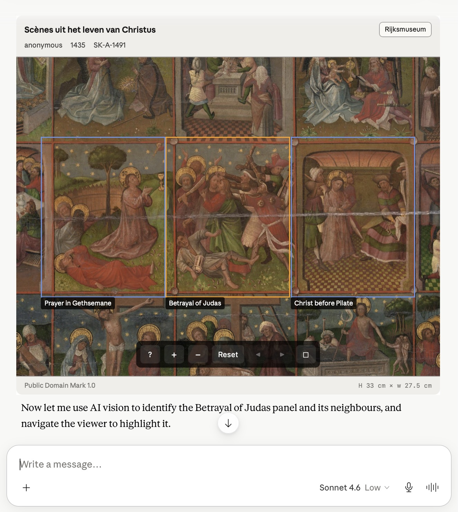

# rijksmuseum-mcp+

[](https://modelcontextprotocol.io/specification/2025-11-25)
[](https://github.com/modelcontextprotocol/ext-apps)

### Overview

**rijksmuseum-mcp+** lets you explore the Rijksmuseum's artwork collections through natural conversation with an AI assistant. It does this by creating a [bridge](https://www.anthropic.com/news/model-context-protocol) between the AI system's chat environment and the museum's [open-access, curated metadata](https://data.rijksmuseum.nl). 

> This project was inspired by [@r-huijts/rijksmuseum-mcp](https://github.com/r-huijts/rijksmuseum-mcp), the original Rijksmuseum MCP server based on the museum's now superseded REST API. 

**rijksmuseum-mcp+** was developed at the [Research and Infrastructure Support](https://rise.unibas.ch/en/) (RISE) group at the University of Basel and builds on our ongoing work on [benchmarking](https://github.com/RISE-UNIBAS/humanities_data_benchmark) and [optimizing](https://github.com/kintopp/dspy-rise-humbench) humanities research tasks carried out by large language models (LLMs). We are particularly interested in exploring the [research opportunities](docs/research-scenarios.md) and technical challenges posed by using structured data with LLMs for humanities research. If you are an interested in collaborating on these questions, please [get in touch](mailto:rise@unibas.ch).

<br>
<p align="center"></p>

### Features

You can explore artworks with the same (with minor exceptions) search filters offered by the Rijksmuseum on their [search collections](https://www.rijksmuseum.nl/en/collection) page. Beyond this, rijksmuseum-mcp+ provides the following additional features:

1. **Search full-text corpora** — (`description`, `inscription`, `provenance`, `creditLine`, `curatorialNarrative`). This permits, for example, comparative analyses of the collection's catalogue entries and the curated wall texts. 

2. **Semantic search** — multilingual, concept/meaning-based explorations across multiple metadata categories. For example, queries like "vanitas symbolism" or "sense of loneliness in domestic interiors" which can't be expressed as structured metadata.

3. **Spatial dimensions** — proximity radius searches on the museum's (`nearPlace`) and size filters (`minWidth`/`maxHeight`) enable spatial queries like "artworks related to places within 25 km of Leiden" or "prints smaller than 10 cm wide" as well as two new parameters (`nearLat` and `nearLon`) to enable spatial queries from arbitrary locations ("find artworks depicting places near me").

4. **Smart searching and ranking** — English subject-based queries use morphological stemming (plurals, gerunds, past tenses) to make search term more forgiving. Large result sets that need to be truncated include faceted counts to allow the AI assistant to suggest additional filters. Textual queries are ranked by relevance instead of catalogue order, while filter-only queries are ordered by their expected importance to most users (drawing on image availability, metadata richness, and `curatorialNarrative`). 

5. **More metadata** — several metadata fields not searchable from the museum's [search portal](https://www.rijksmuseum.nl/en/collection): `birthPlace` / `deathPlace`, `profession`, creator demographics (`gender`, `birth/death years`, `biographical notes`), place hierarchy expansion for spatial searches, title search across all 6 title variants (`title` — brief, full, former × EN/NL vs the website's brief titles only), and bibliography citations for individual artworks.

6. **Iconclass** — access to its own [Iconclass](https://iconclass.org) database, cross-linked with the Rijksmuseum's metadata, which can be searched and explored not just by notation by also title, description, parent/child classes and semantically by concept.

7. **Interactive Image Viewer** — view high-resolution images of artworks inline in your chat discussion (N.B. this feature requires [Claude Desktop](https://claude.com/download) or [claude.ai](https://claude.ai)). Zoom, pan, rotate, flip horizontally or view the image full-screen.

8. **AI image analysis** (experimental) — the AI assistant can analyse images visually in combination with its own background knowledge and the artwork's structured data (e.g. "which iconographic elements of the Annunciation in this image have corresponding entries in Iconclass?").

9. **AI image annotation** (experimental) - the AI assistant can annotate images in the interactive image viewer with elements it has recognised (e.g. "highlight the biblical scenes depicted in the painting's panels").

10. **User image annotation** (experimental) - click inside the image viewer to give it focus, then press `i` or click the rightmost button in the image viewer toolbar. This puts the viewer in `interactive` mode. Now click and draw a rectangle around an area of interest to you. You'll be asked for permission to allow a prompt (with the coordinates of the area you selected) to be written into the chat. Then add your own prompt after it (e.g. 'what's inside the highlighted area' or simply 'what is that?').

11. **Structured outputs** — As most of the data provided by rijksmuseum-mcp+ is in structured form, it's often straightforward for the AI assistant to also represent or export these in a structured manner (e.g. tabular formats) or draw on them for follow-up tasks, such as visualizations ("show me a map of places depicted in artworks within 50 km of Basel") or other AI-enabled analyses.

## Quick Start

The best way to get started is with [Claude Desktop](https://claude.com/download) or [claude.ai](https://claude.ai) by adding a custom 'Connector' to Claude using the URL below. This currently requires a paid ('Pro') or higher [subscription](https://claude.com/pricing) from Anthropic.
```
https://rijksmuseum-mcp-plus-production.up.railway.app/mcp
```
Goto _Settings_ → _Connectors_ → _Add custom connector_ → Name it whatever you like and paste the URL shown above into the _Remote MCP Server URL_ field. You can ignore the Authentication section. Once the connector is configured, set the permissions for its tools (e.g. 'Always allow'). See Anthropic's [instructions](https://support.claude.com/en/articles/11175166-get-started-with-custom-connectors-using-remote-mcp) for more details. 

#### Choosing an AI system

Technically speaking, rijksmuseum-mcp+ is a [Model Context Protocol](https://modelcontextprotocol.io/docs/getting-started/intro) (MCP) server. As such, it also works with many other browser based chatbots including those whose large language models (LLMs) can be used **without a paid subscription**. Mistral's [LeChat](https://chat.mistral.ai/chat) is a good example (follow [these instructions](https://help.mistral.ai/en/articles/393572-configuring-a-custom-connector) - note: no authentication is required). It's also compatible with many open-source desktop 'LLM client' applications such as [Jan.ai](https://jan.ai) that are able to make use of local or cloud based LLMs, and agentic coding tools such as [Claude Code](https://github.com/anthropics/claude-code) or [OpenAI Codex](https://openai.com/codex/). In comparison, OpenAI's ChatGPT still only offers limited, 'developer mode' support for MCP servers and while Google has announced MCP support for Gemini it has not indicated when this will be ready.

However, **none can view and interact with images** from the Rijksmuseum's collections in the chat timeline. For this reason, the best way to use this MCP server remains [Claude Desktop](https://claude.com/download) or [claude.ai](https://claude.ai) with an Anthropic 'Pro' [subscription](https://claude.com/pricing) and the current [Claude Sonnet](https://www.anthropic.com/claude/sonnet) model. For complex object recognition tasks, switching to [Claude Opus](https://www.anthropic.com/claude/opus) with extended thinking will often produce better results.

Note to developers: rijksmuseum-mcp+ can also be run as a local MCP server in STDIO mode with local copies of its metadata and embedding databases. Please see the [technical notes](docs/technical-guide.md) for details.

### Sample Queries

After you've added the rijksmuseum-mcp+ 'connector' (aka custom MCP server) to your AI system, test that everything is working correctly by asking your AI assistant to confirm its access: "Which MCP tools can you use to explore the Rijksmuseum's collections?". It should show you a list [like this](docs/available-tools.md).

After that, ask your own questions:

- _What artworks evoke vanitas and mortality?_
- _Show me artworks depicting places within 50m of the Spinhuis in Amsterdam_
- _What works have the iconclass code for fabulous animals?_
- _Which artworks have a provenance linked to Napoleon?_
- _I'm looking for artworks with inscriptions mentioning 'luctor et emergo'_
- _Show me sculptures in the collection by artists born in Leiden_
- _Which paintings are wider than 3 meters?_
- _Which works are attributed to the circle of Hieronymus Bosch?_
- _What photographs does the collection have by artists born in Indonesia?_
- _Has anyone taken a tumble in SK-A-1718? Show me where._

Et bien sûr también puedes explorar संग्रहों को 用你自己的语言。For samples of more complex questions, please see the [research scenarios](docs/research-scenarios.md). 

### How it works

`to be added` These are all the supported [search parameters](docs/search-parameters.md) and [metadata categories](docs/metadata-categories) returned by a search. Here is a [diagram](docs/mcp-workflow-diagram.md) explaining how information flows between a user and the rijksmuseum-mcp+ server.

### Technical notes

`to be added` For now, please see [the technical guide](docs/technical-guide.md) or consult the [DeepWiki entry](https://deepwiki.com/kintopp/rijksmuseum-mcp-plus) for this repo. 

### Tips

**Say what you are actually looking for, not how to find it.** The assistant generally does better when given a research question than a list of parameters. "What prints were made after paintings by Rembrandt?" works better than "search for prints with technique etching by Rembrandt", because the first framing lets the assistant choose the right combination of tools and strategies.

**Try a concept search when structured filters return nothing useful.** If searching by subject, Iconclass, or description doesn't find what you're looking for, asking the assistant to try a concept search (semantic search) can find artworks by meaning rather than exact vocabulary terms. This is especially useful for atmospheric or thematic queries. The assistant can also search Iconclass by concept — finding the right notation code by meaning rather than exact keyword — and then use that notation for a precise structured search.

**The MCP server (rijksmuseum-mcp+) seems stuck**. If the server is not responding, it could be that it has been updated and the connection needs to be refreshed. To fix this, in your AI system's settings (e.g. in _Settings_ in Claude Desktop or claude.ai) disconnect and reconnect the server, and then click on _Configure_ to verify that all permissions are still correct. In other MCP clients, you may not be able to disconnect/reconnect. In that case, remove and add the server again.

### Known Limitations

**Text coverage and language vary by field.** About 61% of records include a cataloguer's description (in Dutch). Curatorial wall texts (in English) cover only about 14,000 artworks — mostly highlights and recent acquisitions. Because `description` is in Dutch, English search terms won't match — use `curatorialNarrative` for English full-text search, or `semantic_search` which works across languages. Structured vocabulary labels for subjects, types, materials, and techniques are bilingual for about 70% of terms (using [Getty AAT](https://www.getty.edu/research/tools/vocabularies/aat/) equivalents). Places, events, professions, and production roles are mostly Dutch-only — though major cities, countries, and common roles (e.g. "painter", "photographer") have English labels. The AI assistant knows to try the Dutch term when an English search returns no results (and vice versa).

**Iconclass subject classification can be counterintuitive.** The Iconclass system assigns subjects to specific branches of a strict hierarchy that does not always match everyday expectations. However, the assistant can search Iconclass by concept as well as by keyword — describing what you're looking for in plain language (e.g. "domestic animals" or "religious suffering") will often find the right notation even when the exact vocabulary term is unknown.

**Not all maker relation types are available.** The Rijksmuseum's [collection search](https://www.rijksmuseum.nl/en/collection) offers 16 maker sub-types (e.g. "Attributed to", "Made after", "Signed by", "Rejected maker"). rijksmuseum-mcp+ currently captures four of these as structured `attributionQualifier` values — "attributed to", "workshop of", "circle of", and "follower of". Three additional qualifiers ("after", "possibly", and a second "circle of" type) are present in the Linked Art data and will be added in a future update. The remaining sub-types ("Signed by", "Manner of", "Rejected maker", "Falsification after") are being looked at – these may not be available via the public Linked Art API. 

**Image analysis works better than image annotation.** LLMs are generally more accurate at describing the contents of an image than annotating it. For example, the AI assistant will often correctly describe what it can 'see' (even drawing on the detailed `description` field for guidance) but struggle to place accurate bounding-boxes around this content.

### Roadmap

Recent ([v0.20](https://github.com/kintopp/rijksmuseum-mcp-plus/releases/tag/v0.20)):

  - Search by creator gender, birth year range, and attribution qualifier (e.g. "works from Rembrandt's workshop")
  - Place hierarchy expansion (searching for "Netherlands" now includes Amsterdam, Delft, Haarlem, etc. automatically)
  - Artwork details now show creator biographical info: life dates, gender, biographical notes, Wikidata links
  - 31,000 places now geocoded with lat/longs (up from 21,000) 
  - Updated search parameter reference with all 37 filters documented
  - Draw a region on the image viewer and ask the AI assistant about it

Soon:

- review performance of MCP clients besides Anthropic's Claude
- update documentation
- fine-tune query strategies
- v1.0 release
- paper/presentation

Later:

- investigate support for MCP [elicitations](https://modelcontextprotocol.io/docs/learn/client-concepts#elicitation)
- create a [SKILL](https://support.claude.com/en/articles/12580051-teach-claude-your-way-of-working-using-skills) file for exploring the collection
- investigate adding `attributionQualifier`: "after", "possibly", and "circle of" (second type)
- investigate exporting jpg/png from image viewer together with overlays
- investigate adding RGB pixel analyses of images

Maybe:

- investigate adding `attributionQualifier`: "Signed by", "Manner of", "Rejected maker", "Falsification after" 
- investigate incorporating historical exhibition data
- investigate integration with other Linked Open Data resources (e.g. [Colonial Collections](https://data.colonialcollections.nl))
- investigate support for image similarity search (whole image, [image segments](https://engineering.q42.nl/visual-search/))
- investigate support for `attributed_by` data (condition report,  X-radiography, paint samples etc.)
- investigate browsing all related images in the image viewer
- review remaining toponyms without geolocation data

### Authors

[Arno Bosse](https://orcid.org/0000-0003-3681-1289) — [RISE](https://rise.unibas.ch/), University of Basel with [Claude Code](https://claude.com/product/claude-code), Anthropic.

### Citation

If you use rijksmuseum-mcp+ in your research, please cite it as follows. A `CITATION.cff` file is included for use with Zotero, GitHub's "Cite this repository" button, and other reference managers.

**APA (7th ed.)**

> Bosse, A. (2026). *rijksmuseum-mcp+* (Version 0.19.0) [Software]. Research and Infrastructure Support (RISE), University of Basel. https://github.com/kintopp/rijksmuseum-mcp-plus

**BibTeX**
```bibtex
@software{bosse_2026_rijksmuseum_mcp_plus,
  author    = {Bosse, Arno},
  title     = {{rijksmuseum-mcp+}},
  year      = {2026},
  version   = {0.20},
  publisher = {Research and Infrastructure Support (RISE), University of Basel},
  url       = {https://github.com/kintopp/rijksmuseum-mcp-plus},
  orcid     = {0000-0003-3681-1289},
  note      = {Developed with Claude Code (Anthropic, \url{https://www.anthropic.com})}
}
```

### Image and Data Credits

Collection data and images are provided by the **[Rijksmuseum, Amsterdam](https://www.rijksmuseum.nl/)** via their [Linked Open Data APIs](https://data.rijksmuseum.nl/).

**Licensing:** Information and data that are no longer (or never were) protected by copyright carry the **Public Domain Mark** and/or **[CC0 1.0](https://creativecommons.org/publicdomain/zero/1.0/)**. Where the Rijksmuseum holds copyright, it generally waives its rights under CC0 1.0; in cases where it does exercise copyright, materials are made available under **[CC BY 4.0](https://creativecommons.org/licenses/by/4.0/)**. Materials under third-party copyright without express permission are not made available as open data. Individual licence designations appear on the [collection website](https://www.rijksmuseum.nl/en/rijksstudio).

**Attribution:** The Rijksmuseum considers it good practice to provide attribution and/or source citation via a credit line and data citation, regardless of the licence applied.

Please see the Rijksmuseum's [information and data policy](https://data.rijksmuseum.nl/policy/information-and-data-policy) for the full terms.

### License

This project is licensed under the [MIT License](LICENSE).
