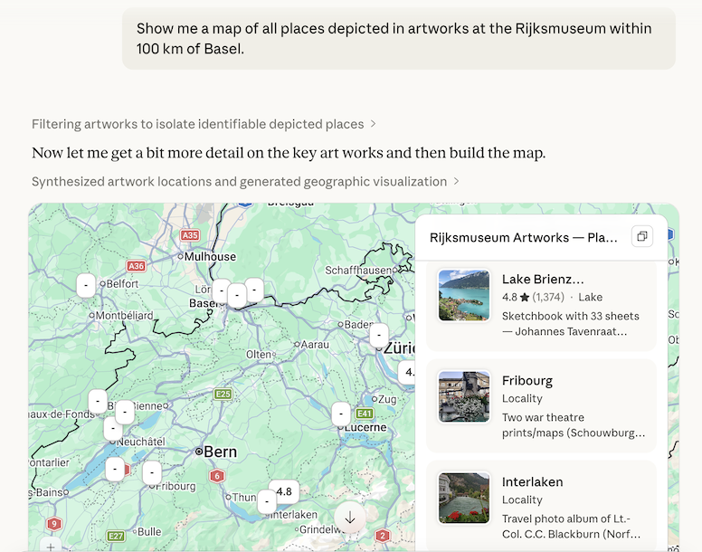

# rijksmuseum-mcp+

[](https://modelcontextprotocol.io/specification/2025-11-25)
[](https://github.com/modelcontextprotocol/ext-apps)

## Overview

**rijksmuseum-mcp+** lets you explore the Rijksmuseum's artwork collections through natural conversation with an AI assistant. It does this by creating a [bridge](https://www.anthropic.com/news/model-context-protocol) between the AI system's chat environment and the museum's [open-access, curated metadata](https://data.rijksmuseum.nl). 

> This project was inspired by [@r-huijts/rijksmuseum-mcp](https://github.com/r-huijts/rijksmuseum-mcp), the original Rijksmuseum MCP server based on the museum's now superseded REST API. 

**rijksmuseum-mcp+** was developed at the [Research and Infrastructure Support](https://rise.unibas.ch/en/) (RISE) group at the University of Basel and builds on our ongoing work on [benchmarking](https://github.com/RISE-UNIBAS/humanities_data_benchmark) and [optimizing](https://github.com/kintopp/dspy-rise-humbench) humanities research tasks carried out by large language models (LLMs). We are particularly interested in exploring the [research opportunities](docs/research-scenarios.md) and technical challenges posed by using structured humanities data with LLMs. If you are an interested in collaborating with us in this area, please [get in touch](mailto:rise@unibas.ch).

<br>
<p align="center"></p>

## Features

You can explore artworks with the same (with minor exceptions) search filters offered by the Rijksmuseum on their [search collections](https://www.rijksmuseum.nl/en/collection) page. Beyond this, rijksmuseum-mcp+ provides the following additional features:

1. **Full-text corpora** — (`description`, `inscription`, `provenance`, `creditLine`, `curatorialNarrative`). This permits, for example, comparative analyses of the collection's catalogue entries and the curated wall texts.

2. **Semantic search** — multilingual, concept/meaning-based explorations across multiple metadata categories. For example, queries like "vanitas symbolism" or "sense of loneliness in domestic interiors" which can't be expressed as structured metadata.

3. **Spatial dimensions** — proximity radius searches on the museum's (`nearPlace`) and size filters (`minWidth`/`maxHeight`) enable spatial queries like "artworks related to places within 25 km of Leiden" or "prints smaller than 10 cm wide" as well as two new parameters (`nearLat` and `nearLon`) to enable spatial queries from arbitrary locations ("find artworks depicting places near me").

4. **Smart searching and relevance ranking** — morphological stemming (e.g. singular/plural) to make subject searches more forgiving; automatic faceted counts on large search results to allow the AI assistant to suggest appropriate filters; textual queries ranked by relevance instead of catalogue order, and filter-only queries ranked by their expected importance to users. 

5. **More searchable metadata** — metadata fields not searchable from the museum's [search portal](https://www.rijksmuseum.nl/en/collection) including `creator` demographics, all 6 `title` variants (brief, full, former × EN/NL), bibliography citations for individual artworks, a linked [Iconclass](https://iconclass.org) database, cross-referenced with the Rijksmuseum's metadata, which can be explored by keyword, semantically, or by hierarchy.

7. **Interactive Image Viewer** — view high-resolution images of artworks inline in your chat discussion (N.B. this feature requires [Claude Desktop](https://claude.com/download) or [claude.ai](https://claude.ai)). Zoom, pan, rotate, flip horizontally or view the image full-screen.

8. **AI image analysis** — the AI assistant can analyse images visually in conjunction with the collection's metadata (e.g. "which iconographic elements of the Annunciation in this image have corresponding entries in Iconclass?").

9. **AI image annotation** - the AI assistant can zoom in and annotate images in the interactive image viewer (e.g. "highlight the biblical scenes depicted in the painting's panels"). Else, draw a rectangle around an area of interest to highlight it for the AI assistant (e.g. 'identify the species of butterfy highlighted in the still-life').

10. **Find similar artworks** - Generates a webpage with a visual comparison of a given artwork showing multiple forms of similarity side by side: Visual, Iconclass, Lineage, Description, Depicted Person, and Depicted Place.

<br>
<p align="center"></p>

## Quick Start

The best way to get started is with [Claude Desktop](https://claude.com/download) or [claude.ai](https://claude.ai) by adding a custom 'Connector' to Claude using the URL below. This currently requires a paid ('Pro') or higher [subscription](https://claude.com/pricing) from Anthropic.
```
https://rijksmuseum-mcp-plus-production.up.railway.app/mcp
```
Goto _Settings_ → _Connectors_ → _Add custom connector_ → Name it whatever you like and paste the URL shown above into the _Remote MCP Server URL_ field. You can ignore the Authentication section. Once the connector is configured, set the permissions for its tools (e.g. 'Always allow'). See Anthropic's [instructions](https://support.claude.com/en/articles/11175166-get-started-with-custom-connectors-using-remote-mcp) for more details. 

#### Choosing an AI system

Technically speaking, rijksmuseum-mcp+ is a [Model Context Protocol](https://modelcontextprotocol.io/docs/getting-started/intro) (MCP) server. As such, it also works with many other browser based chatbots including those whose large language models (LLMs) can be used **without a paid subscription**. Mistral's [LeChat](https://chat.mistral.ai/chat) is a good example (follow [these instructions](https://help.mistral.ai/en/articles/393572-configuring-a-custom-connector) - note: no authentication is required). It's also compatible with many open-source desktop 'LLM client' applications such as [Jan.ai](https://jan.ai) that are able to make use of local or cloud based LLMs. In comparison, OpenAI's ChatGPT still only offers limited, 'developer mode' support for MCP servers and while Google has announced MCP support for Gemini it has not indicated when this will be ready.

However, none of the above allow you to view and interact with images in the chat timeline. For this reason, the best way to use this MCP server remains [Claude Desktop](https://claude.com/download) or [claude.ai](https://claude.ai). For complex object recognition tasks, switching to [Claude Opus](https://www.anthropic.com/claude/opus) with extended thinking will often produce better results.

Note to developers: rijksmuseum-mcp+ can also be run as a local MCP server in STDIO mode with local copies of its metadata and embedding databases. Please see the [technical notes](docs/technical-guide.md) for details.

## Sample Queries

After you've added the rijksmuseum-mcp+ 'connector' (aka custom MCP server) to your AI system, test that everything is working correctly by asking your AI assistant to confirm its access: "Which MCP tools can you use to explore the Rijksmuseum's collections?". 

After that, ask your own questions:

- _What artworks evoke vanitas and mortality?_
- _A list of works of the interior of the Nieuwe Kerk in Amsterdam_
- _Is there an iconclass code for mythical creatures?_
- _Which artworks have a provenance linked to Napoleon Bonaparte?_
- _I'm looking for works with inscriptions mentioning 'luctor et emergo'_
- _Show me sculptures in the collection by artists born in Leiden_
- _Which paintings are wider than 3 meters?_
- _Does the Rijksmuseum hold any works made in the manner of Hieronymus Bosch?_
- _What photographs does the collection have by artists born in Indonesia?_
- _Show me the Roermond Passion and highlight the Betrayal of Judas_

For samples of more complex questions, please see the [research scenarios](docs/research-scenarios.md). 

## How it works

`to be added`. Here are references to the available [search parameters](docs/search-parameters.md) and [metadata categories](docs/metadata-categories.md). These [diagrams](docs/mcp-workflow-diagram.md) illustrate the structure and flow of information when using rijksmuseum-mcp+.

## Roadmap

Soon:

- update documentation
- fine-tune query strategies
- v1.0 release
- paper/presentation

Later:

- investigate support for MCP [elicitations](https://modelcontextprotocol.io/docs/learn/client-concepts#elicitation)
- create a [SKILL](https://support.claude.com/en/articles/12580051-teach-claude-your-way-of-working-using-skills) file for exploring the collection
- review capabilities of MCP clients besides Anthropic's Claude
- investigate exporting jpg/png from image viewer together with overlays

Maybe:

- investigate adding `attributionQualifier`: "Signed by", "Manner of", "Rejected maker", "Falsification after" 
- investigate incorporating historical exhibition data
- investigate parsing provenance data
- investigate integration with other Linked Open Data resources (e.g. [Colonial Collections](https://data.colonialcollections.nl))
- investigate browsing related images in the image viewer
- review remaining places without geolocation data

## Authors

[Arno Bosse](https://orcid.org/0000-0003-3681-1289) — [RISE](https://rise.unibas.ch/), University of Basel with [Claude Code](https://claude.com/product/claude-code), Anthropic.

## Citation

If you use rijksmuseum-mcp+ in your research, please cite it as follows. A `CITATION.cff` file is included for use with Zotero, GitHub's "Cite this repository" button, and other reference managers.

**APA (7th ed.)**

> Bosse, A. (2026). *rijksmuseum-mcp+* (Version 0.19.0) [Software]. Research and Infrastructure Support (RISE), University of Basel. https://github.com/kintopp/rijksmuseum-mcp-plus

**BibTeX**
```bibtex
@software{bosse_2026_rijksmuseum_mcp_plus,
  author    = {Bosse, Arno},
  title     = {{rijksmuseum-mcp+}},
  year      = {2026},
  version   = {0.20},
  publisher = {Research and Infrastructure Support (RISE), University of Basel},
  url       = {https://github.com/kintopp/rijksmuseum-mcp-plus},
  orcid     = {0000-0003-3681-1289},
  note      = {Developed with Claude Code (Anthropic, \url{https://www.anthropic.com})}
}
```

## Image and Data Credits

Collection data and images are provided by the **[Rijksmuseum, Amsterdam](https://www.rijksmuseum.nl/)** via their [Linked Open Data APIs](https://data.rijksmuseum.nl/).

**Licensing:** Information and data that are no longer (or never were) protected by copyright carry the **Public Domain Mark** and/or **[CC0 1.0](https://creativecommons.org/publicdomain/zero/1.0/)**. Where the Rijksmuseum holds copyright, it generally waives its rights under CC0 1.0; in cases where it does exercise copyright, materials are made available under **[CC BY 4.0](https://creativecommons.org/licenses/by/4.0/)**. Materials under third-party copyright without express permission are not made available as open data. Individual licence designations appear on the [collection website](https://www.rijksmuseum.nl/en/rijksstudio).

**Attribution:** The Rijksmuseum considers it good practice to provide attribution and/or source citation via a credit line and data citation, regardless of the licence applied.

Please see the Rijksmuseum's [information and data policy](https://data.rijksmuseum.nl/policy/information-and-data-policy) for the full terms.

## License

This project is licensed under the [MIT License](LICENSE).
