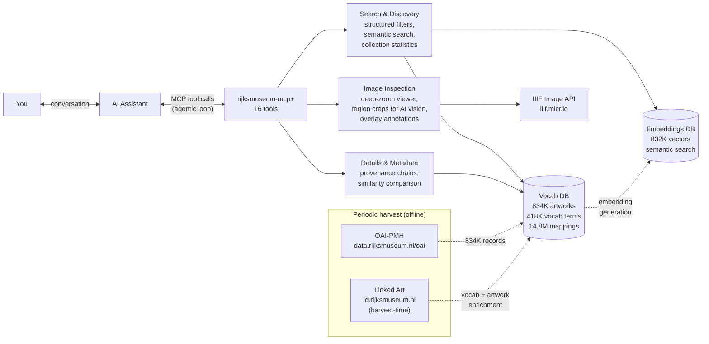

# rijksmuseum-mcp+

[](https://modelcontextprotocol.io/specification/2025-11-25)
[](https://github.com/modelcontextprotocol/ext-apps)

## Overview

**rijksmuseum-mcp+** lets you explore the Rijksmuseum's artwork collections through natural conversation with an AI assistant. It does this by creating a [bridge](https://www.anthropic.com/news/model-context-protocol) between the AI system's chat environment and an enriched copy of the museum's [open-access, curated metadata](https://data.rijksmuseum.nl). This in turn enables many additional features beyond those offered by the Rijksmuseum's [Search API](https://data.rijksmuseum.nl) and [collections portal](https://www.rijksmuseum.nl/en/collection/), including full-text semantic search, structured provenance analysis, artwork similarity comparisons, AI-based visual analysis, and geospatial search. Rijksmuseum-mcp+ works best when used together with [rijksmuseum-iconclass-mcp](https://github.com/kintopp/rijksmuseum-iconclass-mcp), an analogous resource for searching and exploring [Iconclass](https://iconclass.org) concepts.

> Please do not treat the data made available by this resource as current or authoritative. It is based on data copied from the Rijksmuseum on May 2nd, 2026. For current data, please always use the Rijksmuseum's own [search portal](https://www.rijksmuseum.nl/en/collection/) and [APIs](https://data.rijksmuseum.nl). Nor have the (in small part, also LLM based) enrichments of the museum's provenance data been reviewed or endorsed by the Rijksmuseum. This is an early pre-release of a technology demo that is still in active development. It is likely to include errors.

This tool was developed as a technology demo by the [Research and Infrastructure Support](https://rise.unibas.ch/en/) (RISE) group at the University of Basel. We are particularly interested in exploring the research opportunities, methodological risks, and technical challenges posed by retrieving and analysing data with LLMs. If you are interested in collaborating with us in this area, please [get in touch](mailto:rise@unibas.ch).

<p align="center"></p>

## Quick Start

The best way to get started is with [Claude Desktop](https://claude.com/download) or [claude.ai](https://claude.ai) by adding rijksmuseum-mcp+ as a [custom 'Connector'](https://support.claude.com/en/articles/11175166-get-started-with-custom-connectors-using-remote-mcp) to Claude using the URL below. This currently requires a paid ('Pro') or higher [subscription](https://claude.com/pricing) from Anthropic.
```
https://rijksmuseum-mcp-plus-production.up.railway.app/mcp
```
Go to _Customize_ → _Connectors_ → _Add custom connector_ → Name it as you like and paste the URL into the _Remote MCP Server URL_ field. You can ignore the Authentication section. Once the connector is configured, optionally set the permissions for its tools (e.g. 'Always allow'). See Anthropic's [instructions](https://support.claude.com/en/articles/11175166-get-started-with-custom-connectors-using-remote-mcp) for more detailed instructions.

Afterwards, follow the same procedure to install rijksmuseum-mcp+'s companion [IconClass](https://iconclass.org) resource, [rijksmuseum-iconclass-mcp](https://github.com/kintopp/rijksmuseum-iconclass-mcp). This allows you to automatically search and explore c. 1.3 million Iconclass notations, concepts, and descriptive texts alongside the Rijksmuseum's metadata.

It is possible (with some tradeoffs) to use rijksmuseum-mcp+ without a paid subscription. For more details, please see the [Choosing an AI system](#choosing-an-ai-system) section below.

## Research skill

The `rijksmuseum-mcp+` skill file ([.zip archive](docs/skills/rijksmuseum-mcp-plus.skill.zip)) gives the AI assistant detailed guidance in natural language on how to use rijksmuseum-mcp+ effectively: which tool to choose for a given question type, how to combine searches, important metadata distinctions (e.g. `subject` terms vs `iconclass` notations), and known limitations. The package also includes reference files with full description of the available provenance search patterns and the `find_similar` functionality. Making use of a skill is optional but will significantly improve the quality and efficiency of your AI assistant's responses when exploring the collection.

The downloaded skill file can be installed in Claude by following [these instructions](https://claude.com/resources/tutorials/teach-claude-your-way-of-working-using-skills). Skills were [originally developed by Anthropic](https://support.claude.com/en/articles/12512176-what-are-skills) for their Claude products but have since become an [open standard](https://agentskills.io/home). Even chatbots and applications without explicit support for skill packages can make use of the rijksmuseum-mcp+ skill by uploading/sharing [its components](/docs/skills/rijksmuseum-mcp-plus/) with an AI assistant at the start of a research session. Some chatbots (e.g. Mistral's [LeChat](https://chat.mistral.ai/chat)) allow you to permanently share files such as this with an LLM across sessions by uploading it to a [personal library](https://help.mistral.ai/en/articles/347582-what-are-libraries-and-how-do-i-use-them-in-le-chat).

## Sample Queries

After you've connected the resource to your AI system, you can search, explore and ask questions about the Rijksmuseum's collections in natural language.

- _What German artworks at the Rijksmuseum evoke vanitas and mortality?_
- _Which artworks have a provenance linked to Emperor Bonaparte?_
- _Show artworks which include an inscription saying, 'Amor vincit omnia'_
- _Find artworks similar to SK-A-2350_
- _Which work in the collection had previously been held for the longest time by the same family?_
- _Show me sculptures in the collection by artists born in Leiden_
- _What are the three largest paintings in the collection by width?_
- _Which 15th-century paintings are listed as workshop productions?_
- _Show me the Roermondse passie and highlight the Betrayal of Judas_
 
For examples of more complex queries and responses, please see the [research scenarios](docs/research-scenarios.md).

## Features

Beside natural language search, rijksmuseum-mcp+ provides the following main features and capabilities:

### More searchable metadata

Where the Rijksmuseum's own [Search API](https://data.rijksmuseum.nl/docs/search) offers around a dozen filter parameters, rijksmuseum-mcp+ provides roughly thirty, and they can be combined freely within a single query. Beyond the basic maker, object type, material, technique, and date filters, you can also search and filter on `subject` matter (Iconclass themes and depicted scenes, matched with basic English stemming so that, e.g., `cat` also finds `cats` and `painting` finds `paint`), the place where a work was produced, curatorial `theme` tags, an artwork's `description`, `inscription`, `provenance`, `creditLine`, and `curatorialNarrative` full-texts, `creator` demographics (e.g. `gender`, `profession`, `birthPlace`), all `title` variants for an artwork, and attribution qualifiers (e.g. `workshop of`, `circle of`, `attributed to`). Physical dimension filters support queries about the size of an artwork (e.g. "paintings wider than 3 metres").

When searching, matching is accent-insensitive (so "Cezanne" finds "Cézanne") and relevance-ranked. The museum's Search API returns results in a fixed order (by internal identifier), not by relevance — so its first hits are not necessarily the best matches, and an AI assistant (or person) who reads only the top few could miss the most relevant work entirely.

You can also search by who or what a work portrays, independently of who made it or where it was produced: a `depictedPerson` query finds artworks portraying a named individual (e.g. portraits of Willem van Oranje), matching a large set of historical name variants, while a `depictedPlace` query finds works that depict a given location (e.g. topographical views of Amsterdam), with automatic disambiguation for multi-word or ambiguous place names.

Full-text queries over the `title`, `description`, `inscription`, and `curatorialNarrative` fields can be structured. This lets you combine boolean clauses, field scoping, proximity, exact phrases, exclusions, and prefix matching, while simultaneously narrowing results with normal filters such as `creator`, `type`, `date`, `material`, or `technique`.

Proximity searches (`nearPlace`, `nearLat` + `nearLon`) on enriched, geocoded places let you find artworks related to locations already in the museum's catalogue (e.g. "artworks depicting places within 25 km of Leiden"). The necessary geo-coordinates were added only where the Rijksmuseum's own metadata provided a link to an external authority such as the Getty [Thesaurus of Geographic Names](https://www.getty.edu/research/tools/vocabularies/tgn/). Alternatively, proximity searches can also be made on the basis of arbitrary, user or AI provided coordinates (`nearPlaceRadius`).

`Iconclass` notations can be searched (also semantically) by title and description and explored hierarchically by following their parent and child branches via the companion [rijksmuseum-iconclass-mcp](https://github.com/kintopp/rijksmuseum-iconclass-mcp) resource. Rijksmuseum-iconclass-mcp also provides custom links to [ArtResearch](https://artresearch.net/) queries to let you view more artworks sharing an Iconclass notation from the collections of the twelve member institutions of the [PHAROS consortium](https://artresearch.net/resource/Partners).

### Semantic search

Rijksmuseum-mcp+ adds support for multilingual, concept-based, exploratory searches drawing simultaneously on the full-texts of several metadata fields (`title`, `description`, `inscription`, `curatorialNarrative`). This allows for broad, interpretive queries of their contents by meaning (e.g. "a sense of loneliness in domestic interiors") that go beyond what structured, keyword-based searches or filters can reveal. For more details, please see [semantic search](/docs/semantic-search.md).

### Browse curated sets

To complement query-driven discovery, the collection can also be explored through thematic and sub-collection groupings curated by Rijksmuseum staff — for example sets of drawings or paintings, or works gathered around an iconographic theme. You can use this to enumerate the available groupings, and list the artworks included in each.

### Interactive image viewer with AI analysis

Images from the Rijkmuseum's collections can be viewed inline in your chat conversation with an interactive, deep-zoom image viewer that supports pan, zoom, rotation, horizontal flip, and full-screen mode. The AI assistant can analyse what it sees in conjunction with the collection's metadata, and can independently zoom into and annotate regions of interest on request with labelled bounding boxes.

By switching the viewer into *interactive mode* (press "i" or click on the □ icon), a user can draw a rectangle around an area of interest. This copies its bounding-box coordinates into the prompt and direct the AI assistant's attention to it (e.g. "identify the species of butterfly I've highlighted in the image"). When the displayed artwork has *related variants* — curator-declared pendants, production stadia, or different examples of the same design — the viewer's < / > buttons let you step through them in place, without leaving the viewer.

### Find similar artworks

A search for artworks 'similar to' other artworks (e.g. "find artworks similar to van Gogh's Zelfportret") creates a custom, comparison webpage that places an artwork alongside the works most similar to it, evaluated across nine dimensions: `visual appearance`, `related variant` (curator-declared pendants, production stadia, different examples), `related object` (other curator-declared edges such as pairs, sets, recto/verso, and reproductions), `artistic lineage` (shared creators, workshops, or attribution chains), `Iconclass subject classification`, `semantic description`, `curatorial themes`, `depicted persons`, and `depicted places`. Works that appear across multiple dimensions are listed in a final, combined "pooled" view, highlighting the most broadly connected artworks in the collection.

Here is [an example](https://kintopp.github.io/rijksmuseum-mcp-plus/similar-to-SK-A-1115.html) of a custom webpage with a `find_similar` analysis. 

### Collection statistics and distributions

Beyond retrieving individual artworks, rijksmuseum-mcp+ can compute aggregate statistics across the whole collection by grouping the collection along a chosen dimension and returning counts, percentages, and histograms (e.g. "how do artwork types break down by century?", "which persons are depicted most often?", or "what is the distribution of provenance transfer types — sale, gift, bequest — for Rembrandt?"). Artwork and provenance filters combine freely, so a single query can ask, for instance, for the `type` breakdown of an artist's autograph paintings, or for sales by decade between 1600 and 1900.

### Search inscriptions

Many artworks carry inscriptions on the object itself — collector's marks, signatures, dates, numbers, and other transcribed text. Rijksmuseum-mcp+ parses these free-text inscription records into structured segments, including recognised Lugt collector's marks, which identify the collectors and dealers through whose hands a work passed. This makes them searchable in their own right (e.g. finding all works bearing a particular collector's mark, signed in a given year, or carrying a specific transcribed phrase).

### Analyse provenance (experimental)

The Rijksmuseum records the ownership history of c. 48,000 artworks as free-text provenance narratives following the [AAM punctuation convention](https://www.museumprovenance.org/pages/standard_v1/). Rijksmuseum-mcp+ has [parsed](https://kintopp.github.io/rijksmuseum-mcp-plus/provenance-parser-visualization.html) and partially enriched these narratives into over 100,000 structured events with a [CMOA-aligned transfer vocabulary](https://www.museumprovenance.org/reference/acquisition_methods/), making them searchable by party name, transfer type (e.g. sale, gift, bequest, inheritance, confiscation or restitution), date range, location, and price in the original historical currency. This enables structured queries such as tracing a collector's activity across the collection, identifying artworks that were confiscated but never restituted, or comparing auction prices in guilders across centuries.

Every provenance record carries searchable provenance-of-provenance metadata tracking how it was enriched. In addition, because some enrichments are inferred by an LLM rather than derived by rule, whenever a provenance search returns LLM-assisted results the server also generates a custom review webpage that sets each artwork's original narrative next to the parsed events and the model's stated reasoning for every inferred classification.

For more details, please see the [provenance reference](https://kintopp.github.io/rijksmuseum-mcp-plus/provenance-patterns.html) documentation.

### Command-line interface

Rijksmuseum-mcp+ includes a command-line interface tool (`rijks-mcp`) for scripting, data pipelines, and reproducible bulk queries. This is itself a lightweight MCP client that drives the same queries the AI assistants use — so a terminal query returns exactly the results an LLM would. It exposes each of the stateless tools as a verb (search, semantic, provenance, details, similar, and more), connecting either to a (hosted) HTTP or its own STDIO server. Output is JSON-first for easy piping into tools such as `jq`, with `--fields`, `--json`, and `--table` formatting options and `rijks-mcp <verb> --help` describing each command.

## Choosing an AI system

Technically speaking, rijksmuseum-mcp+ works with any chatbot or application supporting the open [Model Context Protocol](https://modelcontextprotocol.io/docs/getting-started/intro) (MCP) and [MCP Apps](https://modelcontextprotocol.io/extensions/apps/overview) standards. As such, it also works with many other browser based chatbots including those whose large language models (LLMs) can be used **without a paid subscription**.

Mistral's [LeChat](https://chat.mistral.ai/chat) is an example (follow [these instructions](https://help.mistral.ai/en/articles/393572-configuring-a-custom-connector)) of a browser based chatbot with very good, basic support of the MCP standard. In addition, many desktop 'LLM client' applications, such as [Jan.ai](https://jan.ai), are also MCP-compatible, and can be used with other LLM models (including local models). Most agentic coding applications (e.g. Claude Code or OpenAI Codex) also support the MCP standard. OpenAI's ChatGPT can also be used as a rijksmuseum-mcp+ MCP client but only in 'developer mode' and in conjunction with a paid subscription. Google has announced MCP support for Gemini but has not indicated when this will be ready.

However, subjectively speaking, most of the LLMs powering alternative AI assistants are not as 'smart' in their use of this MCP server as Anthropic's leading models. For this reason, at present (June, 2026), the best way to use rijksmuseum-mcp+ remains Anthropic's [Claude Desktop](https://claude.com/download) or [claude.ai](https://claude.ai) combined with a paid ('Pro') or higher [subscription](https://claude.com/pricing). ChatGPT plus a supscription is a good second choice. And if a paid subscription is not feasible, Mistral's [LeChat](https://chat.mistral.ai/chat) using its free model also works well, albeit slowly and with less intelligence.

## How it works

When you submit your question, the AI assistant decides on the basis of their [descriptions](/docs/mcp-server+tool-descriptions.md) which combination of [tools](/docs/available-tools.md) and [search parameters](/docs/mcp-tool-parameters.md) provided by rijksmuseum-mcp+ will best answer it by drawing on the the museum's [metadata](/docs/metadata-categories.md). The assistant might [search](/docs/search-parameters.md) the collection using structured filters (`search_artwork`), look up an artwork's full metadata (`get_artwork_details`), query ownership history (`search_provenance`), or find artworks by meaning or concept (`semantic_search`). During this process, it will often chain several tools together in sequence (the so-called 'agentic loop'), each result informing the next query. The results from each tool come back as structured data and text, which the AI assistant interprets, contextualises, and when satisfied, finally sends back as an answer in natural language.

At each step, the AI assistant can combine the retrieved data with its own background knowledge — about artists, periods, iconographic traditions, and historical context — to offer interpretations that go beyond what the museum's metadata alone can provide. But the form and content of these statements will also be 'grounded' and 'constrained' by the curated metadata it has retrieved, by the instructions given to the AI assistant in the MCP server, and by the specialised domain knowledge and guidance it draws on from the optional [research skill](#research-skill) document. Together, these act as a kind of 'harness' for the AI assistant, keeping it factually grounded on the curated metadata and the user's query.

Because rijksmuseum-mcp+ maintains its own copy of Rijksmuseum and (via rijksmuseum-iconclass-mcp) Iconclass metadata, it can organise, enrich, query and analyse this in ways that are not possible by querying the Rijksmuseum collections portal or search API. A separate database enables, for example:

- searching full-text metadata in relevance ranked order
- retrieving metadata semantically by meaning or concept
- enriching toponyms (places) with long/lat data to permit proximity and region-based search
- parsing provenance texts to create structured, searchable ownership chains
- comparing artworks across multiple dimensions of 'similarity'

In essence, rijksmuseum-mcp+ trades the conceptual simplicity of a traditional search interface, where you formulate a keyword-based query, receive results, and interpret these yourself, for a more flexible and powerful but also more complex scenario, where an AI assistant can search metadata, combine, and interpret the results on your behalf. Importantly, because the AI assistant has access not only to what it retrieves but also the way this data is organised, it is also able to offer a certain degree of 'introspection' on its actions – to explain how and why a query was conducted, what the data it retrieved looked like, and recommend options for how best to carry out a query.


```mermaid
flowchart LR
    User["You"] <-->|conversation| AI["AI Assistant"]

    AI <-->|"MCP tool calls
    (agentic loop)"| Server["rijksmuseum-mcp+
    16 tools"]

    Server --> Search["Search & Discovery
    structured filters,
    semantic search,
    collection statistics"]

    Server --> Details["Details & Metadata
    provenance chains,
    similarity comparison"]

    Server --> Images["Image Inspection
    deep-zoom viewer,
    region crops for AI vision,
    overlay annotations"]

    Search --> VocabDB[("Vocab DB
    834K artworks
    418K vocab terms
    14.8M mappings")]
    Search --> EmbeddingsDB[("Embeddings DB
    832K vectors
    semantic search")]
    Details --> VocabDB
    Images --> IIIF["IIIF Image API
    iiif.micr.io"]

    subgraph Harvest ["Periodic harvest (offline)"]
        OAI["OAI-PMH
        data.rijksmuseum.nl/oai"]
        LA["Linked Art
        id.rijksmuseum.nl
        (harvest-time)"]
    end
    OAI -.->|"834K records"| VocabDB
    LA -.->|"vocab + artwork
    enrichment"| VocabDB
    VocabDB -.->|"embedding
    generation"| EmbeddingsDB
```

## Tips and Limitations

- **If a tool call fails unexpectedly, try disconnecting and reconnecting the connector.** Because rijksmuseum-mcp+ runs as a hosted remote MCP server, changes to its configuration from recent updates can leave the connector in a stale state — symptoms include queries never being answered, generic error messages, or the AI assistant reporting that a tool is unavailable. If connecting/disconnecting does not resolve the issue, remove the connector (MCP server) entirely and re-add it.

- **Ask the assistant to explain which tools and filters it used — and steer it if the first answer looks off.** Because rijksmuseum-mcp+ exposes many overlapping search patterns (e.g. keyword filters, semantic search, spatial queries), the AI assistant sometimes picks a narrower or broader strategy than you intended. If a result seems incomplete or suspiciously tidy, ask follow-ups like _"let me the see the remaining artworks for this query as well"_, or _"explain how you reached this result"_. Being explicit in your prompt about whether you want a structured search (e.g. "all paintings by X made in Y") versus an exploratory search (e.g. "list a few...") will help the AI assistant interpret your question correctly. Installing the optional [research skill](#research-skill) will also improve the quality of the responses.

## Technical notes

For local setup (stdio or HTTP, also via cli), deployment, architecture, data sources, and configuration, please see the [technical guide](/docs/technical-guide.md). 

## Roadmap

Ongoing:

- fix bugs and fine-tune queries and tool descriptions
- update README and other documentation

Later:

- paper/presentation
- make tool logic reusable beyond MCP
- investigate DINOv3 image retrieval
- investigate OCR/HTR of artwork images

Maybe:

- new bibliographic SRU MCP server (rijksmuseum-biblio-mcp)
- incorporating historical exhibition data
- integration with other Linked Open Data resources (e.g. [Colonial Collections](https://data.colonialcollections.nl))
- supporting inferred geolocation data
- improving the `description` signal for find_similar (e.g. via a LLM re-ranker)

## Authors

[Arno Bosse](https://orcid.org/0000-0003-3681-1289) — [RISE](https://rise.unibas.ch/), University of Basel with [Claude Code](https://claude.com/product/claude-code), Anthropic.

## Citation

If you use rijksmuseum-mcp+ in your research, please cite it as follows:

**APA (7th ed.)**

> Bosse, A. (2026). *rijksmuseum-mcp+* (Version 0.80.0) [Software]. Research and Infrastructure Support (RISE), University of Basel. https://github.com/kintopp/rijksmuseum-mcp-plus

**BibTeX**
```bibtex
@software{bosse_2026_rijksmuseum_mcp_plus,
  author    = {Bosse, Arno},
  title     = {{rijksmuseum-mcp+}},
  year      = {2026},
  version   = {0.80.0},
  publisher = {Research and Infrastructure Support (RISE), University of Basel},
  url       = {https://github.com/kintopp/rijksmuseum-mcp-plus},
  orcid     = {0000-0003-3681-1289},
  note      = {Developed with Claude Code (Anthropic, \url{https://www.anthropic.com})}
}
```

## Image and Data Credits

Collection data and images are provided by the **[Rijksmuseum, Amsterdam](https://www.rijksmuseum.nl/)** via their [Linked Open Data APIs](https://data.rijksmuseum.nl/).

**Licensing:** Information and data that are no longer (or never were) protected by copyright carry the **Public Domain Mark** and/or **[CC0 1.0](https://creativecommons.org/publicdomain/zero/1.0/)**. Where the Rijksmuseum holds copyright, it generally waives its rights under CC0 1.0; in cases where it does exercise copyright, materials are made available under **[CC BY 4.0](https://creativecommons.org/licenses/by/4.0/)**. Materials under third-party copyright without express permission are not made available as open data. Individual licence designations appear on the [collection website](https://www.rijksmuseum.nl/en/rijksstudio).

**Attribution:** The Rijksmuseum considers it good practice to provide attribution and/or source citation via a credit line and data citation, regardless of the licence applied. Please see the Rijksmuseum's [information and data policy](https://data.rijksmuseum.nl/policy/information-and-data-policy) for the full terms.

> This project was inspired by [@r-huijts/rijksmuseum-mcp](https://github.com/r-huijts/rijksmuseum-mcp), the original Rijksmuseum MCP server based on the museum's now superseded REST API.

## License

This project is licensed under the [MIT License](LICENSE).
