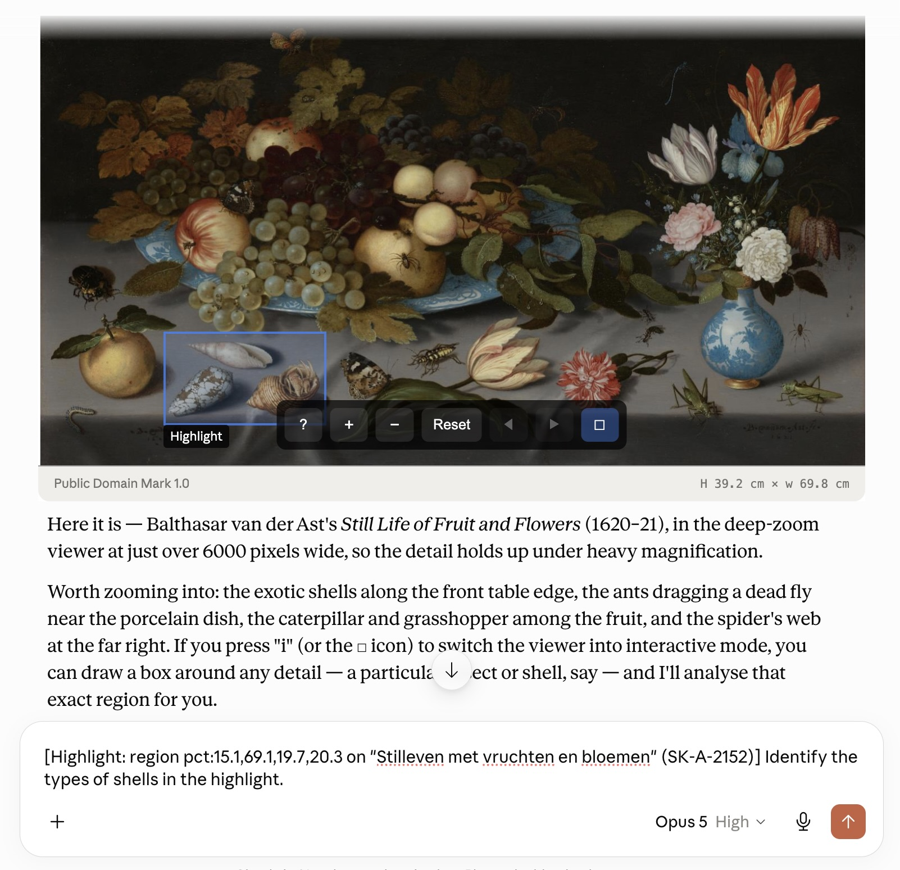
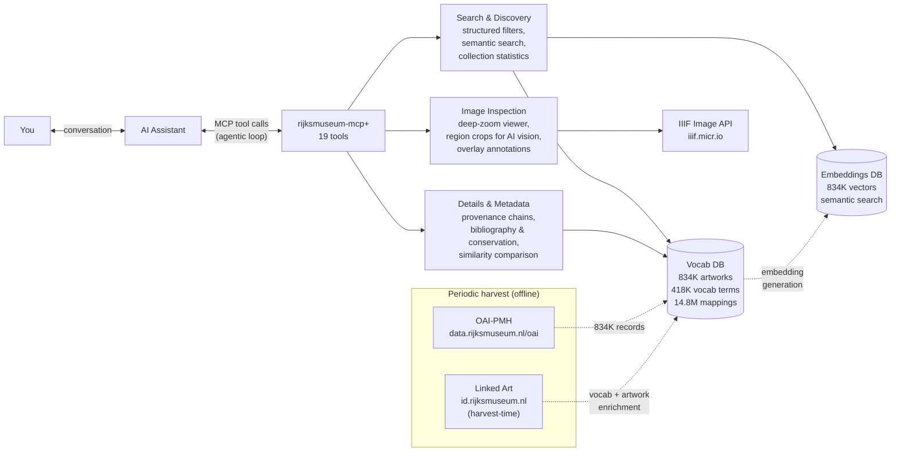

# rijksmuseum-mcp+

[](https://modelcontextprotocol.io/specification/2025-11-25)
[](https://github.com/modelcontextprotocol/ext-apps)

## Overview

The **rijksmuseum-mcp+** MCP server lets you explore the Rijksmuseum's artwork collections through natural conversation with an AI assistant. It does this by creating a [bridge](https://www.anthropic.com/news/model-context-protocol) between the AI system's chat environment and an enriched copy of the museum's [open-access, curated metadata](https://data.rijksmuseum.nl). This in turn enables many features beyond those offered by the Rijksmuseum's own [Search API](https://data.rijksmuseum.nl) and [collections portal](https://www.rijksmuseum.nl/en/collection/), including full-text semantic search, structured provenance analysis, artwork similarity comparisons, AI-supported visual analysis, and geospatial queries. Rijksmuseum-mcp+ works best when used together with [rijksmuseum-iconclass-mcp](https://github.com/kintopp/rijksmuseum-iconclass-mcp), a sibling resource for searching and exploring [Iconclass](https://iconclass.org) concepts.

> Please do not treat the data made available by this resource as current or authoritative. It is based on data copied from the Rijksmuseum on May 2nd, 2026. For current data, please always use the Rijksmuseum's own [search portal](https://www.rijksmuseum.nl/en/collection/) and [APIs](https://data.rijksmuseum.nl). Nor have the (in small part, also LLM based) enrichments of the museum's provenance data been reviewed or endorsed by the Rijksmuseum. This is an early pre-release of a technology demo that is still in active development. It is likely to include errors.

This tool was developed as a technology demo by the [Research and Infrastructure Support](https://rise.unibas.ch/en/) (RISE) group at the University of Basel. We are particularly interested in exploring the research opportunities, methodological risks, and technical challenges posed by retrieving and analysing data with LLMs. If you are interested in collaborating with us in this area, please [get in touch](mailto:rise@unibas.ch).

## Features

- **Finding artworks**. You can search by keyword, by structured filters (artist, type, material, technique, date, physical dimensions, production place), or by meaning — a semantic search that handles interpretive queries like "melancholy winter scenes at dusk". There's also [iconographic search via Iconclass codes](https://kintopp.github.io/rijksmuseum-mcp-plus/iconclass-visualization), so you can ask for works depicting a specific scene or motif rather than just matching words in titles. 
- **Looking closely at works.** Any artwork can be opened in an interactive, inline viewer. You can instruct the AI-assistant to inspect image regions by itself — useful for analysing a specific area of the image you've highlighted for it in the viewer. If an artwork has curator defined related artworks (e.g. preparatory sketches, or different impressions of the same design) these can be accessed through the viewer as well — its < / > buttons step through them in place, without leaving the viewer.
  <p align="center"></p>
- **Collection-level analysis**. You can ask for statistical breakdowns across the whole collection: top creators, distributions by decade, type, or theme, geographic spread, even demographic questions like how works by female artists are distributed across media or centuries.
- **Provenance and ownership history**. Tracing who owned a work and when, which works passed through a particular collector or dealer, sales and confiscations in a given city or period, price histories, and how long families held their collections. Made possible by an [experimental AAM parser](https://kintopp.github.io/rijksmuseum-mcp-plus/provenance-parser-visualization.html) that enables structured, [CMOA/PLOD-aligned queries](https://kintopp.github.io/rijksmuseum-mcp-plus/provenance-patterns.html).
- **Scholarly apparatus**. Bibliographies for individual works, reverse lookups (which artworks cite a given publication), and conservation histories including technical examinations like X-rays, infrared, and dendrochronology.
- **Relationships between works**. A similarity engine ("find images similar to..") [compares works across multiple dimensions](https://kintopp.github.io/rijksmuseum-mcp-plus/similar-to-SK-A-1115.html) — visual, thematic, lineage, shared subject — and surfaces pendants, pairs, copies, reproductive prints after paintings, and different impressions of one design.
- **People and places**. You can search persons by profession, lifespan, or birthplace and then pull up their works, or run geospatial queries like "works depicting places within 20 km of Haarlem".
- **Linked Open Data**. Works carry persistent handle.net URIs and other external IDs, and entities (creators, materials, depicted persons and places, themes) carry identifiers linking them to Wikidata, VIAF, ULAN, and RKD.
- **Command-line interface.** The bundled `rijks-mcp` tool runs the same queries from the terminal — each tool exposed as a verb, with JSONL output for piping into tools such as `jq` so results are scriptable and reproducible.

## Sample Queries

The system is designed to let you search, explore and ask questions about the Rijksmuseum's collections in natural language. For example:

- _What German artworks at the Rijksmuseum evoke vanitas and mortality?_
- _Which artworks have a provenance linked to Emperor Bonaparte?_
- _List all artworks which include the inscription, 'Amor vincit omnia'_
- _Find artworks similar to SK-A-1115_

For examples of more complex queries and sample responses, please browse the [research scenarios](docs/research-scenarios.md). These demonstrate queries on a variety of topics including subject and iconographic search, curated sets, semantic search, provenance research, inscriptions and marks, and conservation.

## Quick Start

The best way to get started is with [Claude Desktop](https://claude.com/download) or [claude.ai](https://claude.ai) by adding rijksmuseum-mcp+ to Claude as a *remotely hosted*, [custom 'Connector'](https://support.claude.com/en/articles/11175166-get-started-with-custom-connectors-using-remote-mcp) using the URL below. This is currently free for one connector – additional connectors require a paid ('Pro') or higher [subscription](https://claude.com/pricing) from Anthropic.
```
https://rijksmuseum-mcp-plus-production.up.railway.app/mcp
```
Go to _Customize_ → _Connectors_ → _Add custom connector_ → Name it as you like and paste the URL into the _Remote MCP Server URL_ field. You can ignore the Authentication section. Once the connector is configured, optionally set the permissions for its tools (e.g. 'Always allow'). See Anthropic's [instructions](https://support.claude.com/en/articles/11175166-get-started-with-custom-connectors-using-remote-mcp) for more detailed instructions.

Many other desktop and web-based clients such as OpenAI's ChatGPT or Mistral's Chat and open-source applications support remotely hosted, custom MCP servers. Please consult their documentation for more information. Alternatively, you can install rijksmuseum-mcp+ *locally* on your own computer. Please consult the [technical guide](/docs/technical-guide.md) for more details.

Afterwards, follow the same procedure to install rijksmuseum-mcp+'s sibling resource for IconClass, [rijksmuseum-iconclass-mcp](https://github.com/kintopp/rijksmuseum-iconclass-mcp). This allows you to automatically search and explore c. 1.3 million [IconClass](https://iconclass.org) notations, concepts, and descriptive texts alongside the Rijksmuseum's metadata.

## Research skill

The `rijksmuseum-mcp+` skill file ([.zip archive](docs/skills/rijksmuseum-mcp-plus.skill.zip)) gives the AI assistant detailed guidance in natural language on how to use rijksmuseum-mcp+ effectively: which tool to choose for a given question type, how to combine searches, important metadata distinctions and known limitations. The package also includes reference files with full description of the available provenance search patterns and the `find_similar` functionality. Skills were [originally developed by Anthropic](https://support.claude.com/en/articles/12512176-what-are-skills) for their Claude products but have since become an [open standard](https://agentskills.io/home). Making use of this skill is optional but will significantly improve the quality and efficiency of your AI assistant's responses when exploring the collection. The downloaded skill file can be installed in Claude by following [these instructions](https://claude.com/resources/tutorials/teach-claude-your-way-of-working-using-skills).

## How it works

When you submit a question, the AI assistant reads the [descriptions](/docs/mcp-server+tool-descriptions.md) of the [tools](/docs/available-tools.md) provided by the MCP server together with their [search parameters](/docs/mcp-tool-parameters.md) and then decides which combination of tools and parameters are best used to query museum's [metadata](/docs/metadata-categories.md) for an answer. During this process, it will often chain several tools together in sequence (the so-called 'agentic loop'), each result informing the next query. For example, the assistant might [search](/docs/search-parameters.md) the collection using structured filters (`search_artwork`), look up an artwork's full metadata (`get_artwork_details`), query ownership history (`search_provenance`), or find artworks by meaning or concept (`semantic_search`).  The results from each tool come back as structured data and text, which the AI assistant interprets, contextualises, and when satisfied, generates for you as an answer in natural language.

At each step, the AI assistant can combine the retrieved data from the Rijksmuseum with its own background knowledge — about artists, periods, iconographic traditions, and historical context — to offer interpretations that go beyond what the museum's metadata alone can provide. But any such interpretation is always 'constrained' by the curated metadata it has retrieved, by the instructions given to the AI assistant in the MCP server, and by the specialised domain knowledge and guidance it draws on from the optional [research skill](#research-skill) document. Together, these act as a kind of 'harness' for the AI assistant, keeping it factually grounded on the curated metadata and the user's query. In essence, this approach trades the conceptual simplicity of a traditional search interface, where you formulate a keyword-based query, receive results, and interpret these yourself, for a more flexible and powerful but also more complex scenario, where an AI assistant can formulate and combine queries, search metadata, and interpret the results on your behalf. In addition, the AI-assistant can offer a certain degree of 'introspection' on its actions – to explain how and why a search was conducted in a certain way, what the data it retrieved looked like, and recommend follow-up actions. 

This blurs the previously clear roles and divisions of responsibility between researcher and data provider. Both sides cede some degree of autonomy to the AI systems over how research can be conducted. And so both should share a degree of responsibility over how these new AI capabilities are defined and employed.


```mermaid
flowchart LR
    User["You"] <-->|conversation| AI["AI Assistant"]

    AI <-->|"MCP tool calls
    (agentic loop)"| Server["rijksmuseum-mcp+
    19 tools"]

    Server --> Search["Search & Discovery
    structured filters,
    semantic search,
    collection statistics"]

    Server --> Details["Details & Metadata
    provenance chains,
    bibliography & conservation,
    similarity comparison"]

    Server --> Images["Image Inspection
    deep-zoom viewer,
    region crops for AI vision,
    overlay annotations"]

    Search --> VocabDB[("Vocab DB
    834K artworks
    418K vocab terms
    14.8M mappings")]
    Search --> EmbeddingsDB[("Embeddings DB
    834K vectors
    semantic search")]
    Details --> VocabDB
    Images --> IIIF["IIIF Image API
    iiif.micr.io"]

    subgraph Harvest ["Periodic harvest (offline)"]
        OAI["OAI-PMH
        data.rijksmuseum.nl/oai"]
        LA["Linked Art
        id.rijksmuseum.nl
        (harvest-time)"]
    end
    OAI -.->|"834K records"| VocabDB
    LA -.->|"vocab + artwork
    enrichment"| VocabDB
    VocabDB -.->|"embedding
    generation"| EmbeddingsDB
```

## Tips and Limitations

- **If something fails unexpectedly, try disconnecting and reconnecting the connector.** Because this is a hosted remote MCP server, changes to its configuration from recent updates can leave your connection in an incorrect state — symptoms include queries never being answered, generic error messages, or the AI assistant reporting that a tool is unavailable. If connecting/disconnecting does not resolve the issue, remove the custom connector (MCP server) entirely and re-add it.
- **Ask the assistant to explain which tools and filters it used.** Because rijksmuseum-mcp+ exposes many overlapping search patterns (e.g. keyword filters, semantic search, spatial queries), the AI assistant sometimes picks a narrower or broader strategy than you intended. If a result seems incomplete or suspiciously tidy, ask follow-ups like _"let me see the remaining artworks for this query as well"_, or _"explain how you reached this result"_. Being explicit in your prompt about whether you want a structured search (e.g. "all paintings by X made in Y") versus an exploratory search (e.g. "list a few...") will help the AI assistant to interpret your question.
- **Add the optional research skill** to help the AI-assistant improve the quality of its responses.

## Technical notes

For local setup (stdio or HTTP, also via cli), deployment, architecture, data sources, and configuration, please see the [technical guide](/docs/technical-guide.md).

## Roadmap

Ongoing:

- fix bugs and fine-tune queries and tool descriptions
- update README and other documentation

Later:

- paper/presentation
- investigate DINOv3 image retrieval
- investigate OCR/HTR of artwork images

Maybe:

- incorporating historical exhibition data
- integration with other Linked Open Data resources (e.g. [Colonial Collections](https://data.colonialcollections.nl))
- supporting inferred geolocation data
- improving the `description` signal for *find_similar* (e.g. via a LLM re-ranker)

## Authors

[Arno Bosse](https://orcid.org/0000-0003-3681-1289) — [RISE](https://rise.unibas.ch/), University of Basel with [Claude Code](https://claude.com/product/claude-code), Anthropic.

## Citation

If you use rijksmuseum-mcp+ in your research, please cite it as follows:

**APA (7th ed.)**

> Bosse, A. (2026). *rijksmuseum-mcp+* (Version 0.90) [Software]. Research and Infrastructure Support (RISE), University of Basel. https://github.com/kintopp/rijksmuseum-mcp-plus

**BibTeX**
```bibtex
@software{bosse_2026_rijksmuseum_mcp_plus,
  author    = {Bosse, Arno},
  title     = {{rijksmuseum-mcp+}},
  year      = {2026},
  version   = {0.90},
  publisher = {Research and Infrastructure Support (RISE), University of Basel},
  url       = {https://github.com/kintopp/rijksmuseum-mcp-plus},
  orcid     = {0000-0003-3681-1289},
  note      = {Developed with Claude Code (Anthropic, \url{https://www.anthropic.com})}
}
```

## Image and Data Credits

Collection data and images are provided by the **[Rijksmuseum, Amsterdam](https://www.rijksmuseum.nl/)** via their [Linked Open Data APIs](https://data.rijksmuseum.nl/).

**Licensing:** Information and data that are no longer (or never were) protected by copyright carry the **Public Domain Mark** and/or **[CC0 1.0](https://creativecommons.org/publicdomain/zero/1.0/)**. Where the Rijksmuseum holds copyright, it generally waives its rights under CC0 1.0; in cases where it does exercise copyright, materials are made available under **[CC BY 4.0](https://creativecommons.org/licenses/by/4.0/)**. Materials under third-party copyright without express permission are not made available as open data. Individual licence designations appear on the [collection website](https://www.rijksmuseum.nl/en/rijksstudio).

**Attribution:** The Rijksmuseum considers it good practice to provide attribution and/or source citation via a credit line and data citation, regardless of the licence applied. Please see the Rijksmuseum's [information and data policy](https://data.rijksmuseum.nl/policy/information-and-data-policy) for the full terms.

> This project was inspired by [@r-huijts/rijksmuseum-mcp](https://github.com/r-huijts/rijksmuseum-mcp), the original Rijksmuseum MCP server based on the museum's now superseded REST API.

## License

This project is licensed under the [MIT License](LICENSE).
