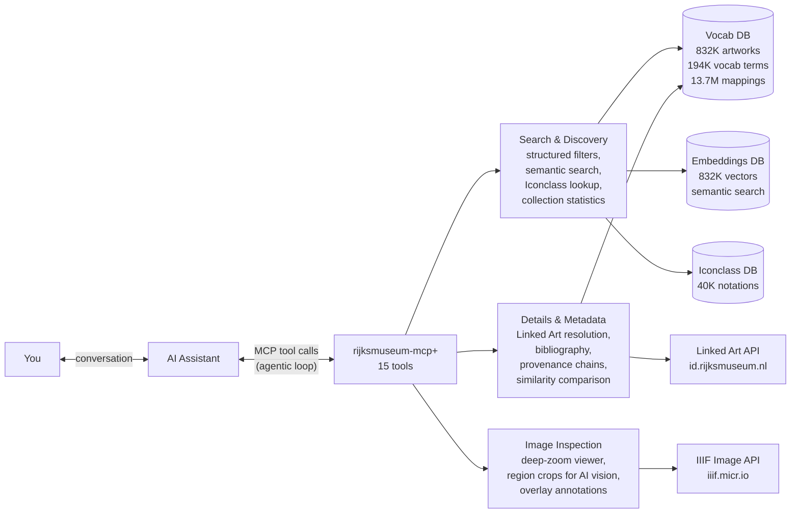
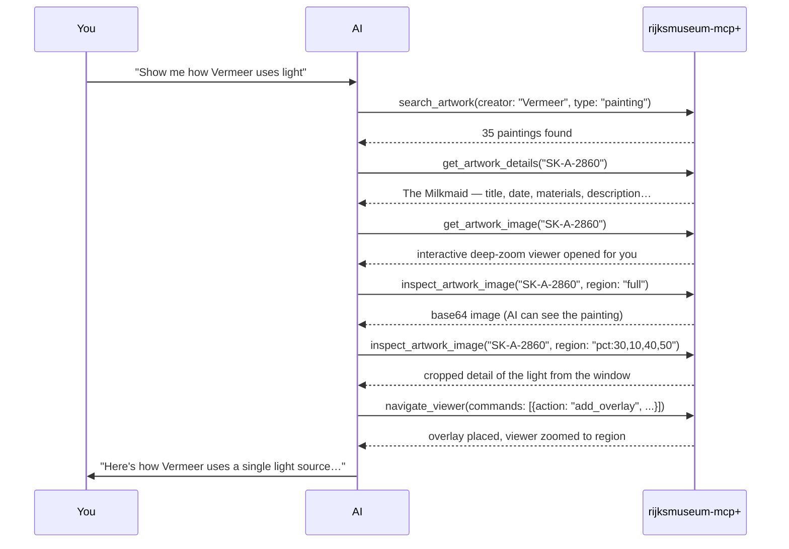

# MCP Workflow Diagram

How an AI assistant uses rijksmuseum-mcp+ to answer a question about art.

**The agentic loop:** the AI assistant doesn't make one call to the MCP server and stop — it chains
tools iteratively, each result informing the next. A single question like
*"show me how Vermeer uses light"* might trigger:

