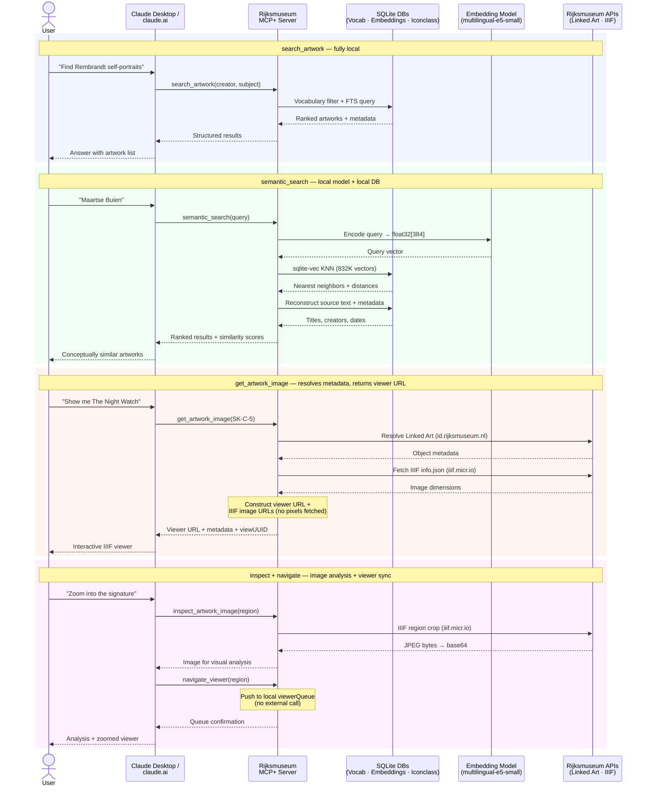

# Rijksmuseum MCP+ — Sequence Diagram

```mermaid
sequenceDiagram
    actor User
    participant Claude as Claude Desktop /<br/>claude.ai
    participant MCP as Rijksmuseum<br/>MCP+ Server
    participant SQLite as SQLite DBs<br/>(Vocab · Embeddings · Iconclass)
    participant Model as Embedding Model<br/>(multilingual-e5-small)
    participant Rijks as Rijksmuseum APIs<br/>(Linked Art · IIIF)

    rect rgb(240, 245, 255)
    Note over User,Rijks: search_artwork — fully local
    User->>Claude: "Find Rembrandt self-portraits"
    Claude->>MCP: search_artwork(creator, subject)
    MCP->>SQLite: Vocabulary filter + FTS query
    SQLite-->>MCP: Ranked artworks + metadata
    MCP-->>Claude: Structured results
    Claude-->>User: Answer with artwork list
    end

    rect rgb(240, 255, 245)
    Note over User,Rijks: semantic_search — local model + local DB
    User->>Claude: "Maartse Buien"
    Claude->>MCP: semantic_search(query)
    MCP->>Model: Encode query → float32[384]
    Model-->>MCP: Query vector
    MCP->>SQLite: sqlite-vec KNN (832K vectors)
    SQLite-->>MCP: Nearest neighbors + distances
    MCP->>SQLite: Reconstruct source text + metadata
    SQLite-->>MCP: Titles, creators, dates
    MCP-->>Claude: Ranked results + similarity scores
    Claude-->>User: Conceptually similar artworks
    end

    rect rgb(255, 245, 240)
    Note over User,Rijks: get_artwork_image — resolves metadata, returns viewer URL
    User->>Claude: "Show me The Night Watch"
    Claude->>MCP: get_artwork_image(SK-C-5)
    MCP->>Rijks: Resolve Linked Art (id.rijksmuseum.nl)
    Rijks-->>MCP: Object metadata
    MCP->>Rijks: Fetch IIIF info.json (iiif.micr.io)
    Rijks-->>MCP: Image dimensions
    Note over MCP: Construct viewer URL +<br/>IIIF image URLs (no pixels fetched)
    MCP-->>Claude: Viewer URL + metadata + viewUUID
    Claude-->>User: Interactive IIIF viewer
    end

    rect rgb(255, 240, 255)
    Note over User,Rijks: inspect + navigate — image analysis + viewer sync
    User->>Claude: "Zoom into the signature"
    Claude->>MCP: inspect_artwork_image(region)
    MCP->>Rijks: IIIF region crop (iiif.micr.io)
    Rijks-->>MCP: JPEG bytes → base64
    MCP-->>Claude: Image for visual analysis
    Claude->>MCP: navigate_viewer(region)
    Note over MCP: Push to local viewerQueue<br/>(no external call)
    MCP-->>Claude: Queue confirmation
    Claude-->>User: Analysis + zoomed viewer
    end
```
